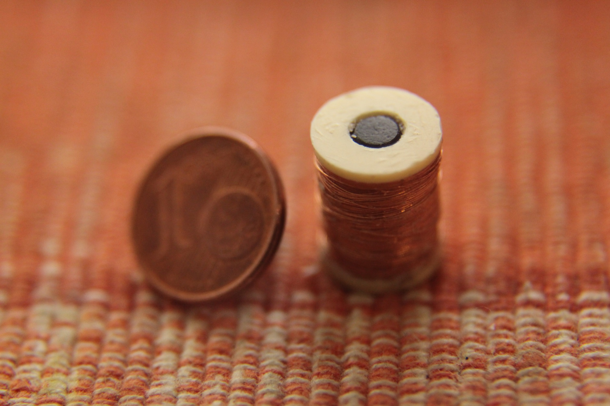
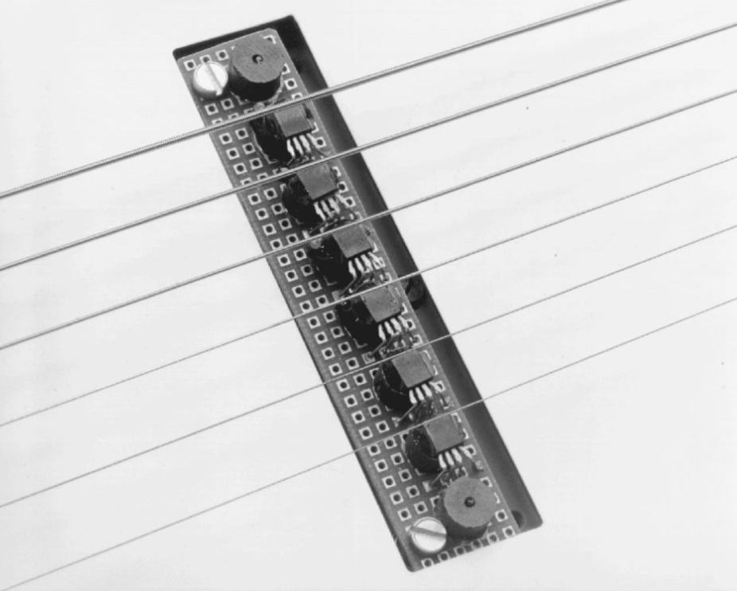
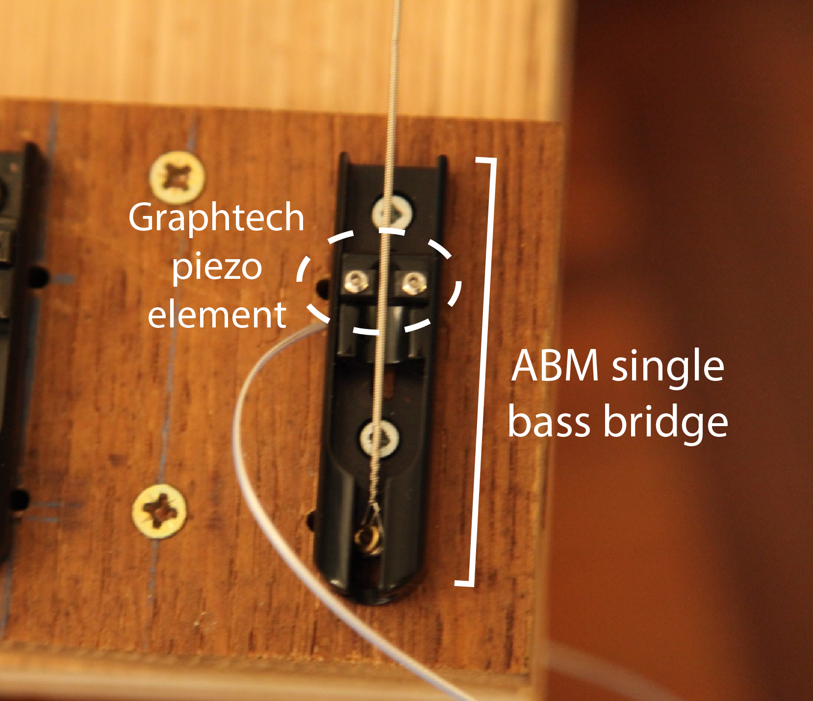

# Choosing the sensor

## Summary

We needed a sensor that was linear enough and immune to the electromagnetic noise produced by the magnetic actuator. We chose a piezo sensor directly installed on the bridge, made for high-end bass guitars. We confirmed experimentally that this choice was preferable to magnetic guitar pickups.

### Available options

Several devices can record the vibration of a string : 

- Magnetic guitar pickups (made of a coil wound around a cylindrical magnet)
- Optical pickups (that use the change of reflection or transmission of light when the string moves)
- Magneto-resistive pickups (a proposed alternative to the traditional magnetic pickup)
- Piezo pickups (ceramic surfaces that produce a voltage proportional to their deformation, used in acoustic and classical guitars)

@@Berdahl2008a and @@Lahdevaara2012 provide two guides to the physics of these sensors.

### The magnetic pickup

Guitar pickups consist of a cylindrical magnet around which is wound a coil of very thin insulated copper wire. For magnetic actuators, the wire diameter is close to 0.3mm (AWG28) whereas a pickup will use 0.05mm diameter wire (AWG44). Their resistance is therefore very different: actuators have a resistance comparable to that of speakers (between $8\Omega$ and $32\Omega$) while sensors are usually in the $\text{k}\Omega$ range, with several thousand turns.

The permanent magnet induces a magnetic moment in the string above it, and the movement of this moment causes a change in the magnetic flux inside the coil, thus producing a measurable voltage.

)](../img/sey-11201-03-rwrp.jpg)

Many analytical models for the magnetic pickups exist (@@Lemarquand2007, @@Horton2009), and they show that the pickup mainly senses the vertical _velocity_ of the string. It exhibits strong distortion, especially when horizontal displacement is also present. This linearity has been confirmed experiementally using high speed linear cameras for reference (@@Mustonen2014).

In electric guitar, this distortion gives a sought-after warm characteristic sound, but for a control system, this greatly complexifies the design of the observer.

Futhermore, since the actuator emits a very strong magnetic field, additional processing is required to suppress the inevitable crosstalk.

> For reference, we found a very advanced modular pickup system with an open source design, called [The Nu Series](http://www.cycfi.com/projects/nu-series/)

### The optical pickup

Optical pickups sense either the change in reflected or transmitted light when a string vibrates. Only one company ([LightWave systems](http://lightwave-systems.com)) currently produces optical pickups, and only directly installed on guitar and bass guitars. This makes it difficult, though already done in academic research@^Overholt2005,  to use them in a control system.

Optical systems are inherently difficult to build, as the transfer function greatly depends on the shape of the emitter, of the linearity of the receiver, the shape of its sensitive area, and the shape of the string. Futhermore, typical optical sensors have a  bandwidth limited to 1kHz, insufficient for audio@^Berdahl2008a.

These sensors are still the subject of research to improve their linearity @^Leroy2006.

](../img/JRC_7729-Edit23.jpg)

### The magneto-resistive pickup

Magneto-resistive devices are very similar to Hall-effect sensors, but they are much more sensistive to magnetic field variations.

Proposed in this report, magneto-resistive pickups are a seducing alternative to traditional inductive pickups. However, they do suffer from the same crosstalk issue with the actuator.

@@Lenssen2002 and @@Atteya2016 have tried adapting these sensors to string instruments, but no commercial pickups exists as of 2016.

### The piezoelectric pickup

Piezoelectric pickups (also called contact microphones) produce a voltage proportional to the force exerted on their surface. They exhibit good linearity properties and are not subjected to direct noise from the actuators.

](../img/Piezoelectric_pickup1.jpg)

Since we aim at having a multi-string instrument with limited crosstalk between the strings, we chose a Graphtech piezo element embedded in an ABM bass single bridge. These pickups are usually installed in high-end custom bass guitars with hexaphonic output.

Strangely, Graphtech pickups come with a unshielded output wires. This is especially surprising since the high impedance of these pickups means the non amplified signal is greatly susceptible to mains hum, and tests showed that it was indeed very audible. We solved this issue by thouroughly shielded the output cable, and by connecting all grounds in the circuit with thick cables.

### Checking for signal quality

> This test was performed after the construction of the test instrument shown in the next section.

We ran a quick test comparing the selected pickup with other piezo and magnetic pickups, by simply connecting them to an oscilloscope and hitting the string. We found that a good technique for exciting mainly the first mode is to attach neodymium magnets to the end of a ferromagnetic object such as the cylindrical end of a screw driver, and using it as a soft magnetic plectrum.

We found that the GraphTech pickup had a better SNR (signal to noise ratio) than the magnetic pickups we tested (which include some homemade single pickups and a commercial guitar pickup). They were also better able to reproduce the highs of the sound. Compared to other piezo pickups installed on the same surface, the GraphTech pickup performed equally; but when exciting the second string, the surface pickup showed a large signal, while the GraphTech was relatively insensitive to it.

Having now a satisfying sensor, we could procede to [completing the test setup](/making_sitemp).