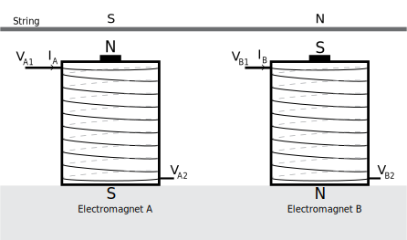

# Discussion : technical compairison with other setups

## The Magnetic Resonator Piano

The Magnetic Resonator Piano (MRP)@^McPherson2010 is an augmented piano which strings are excited by electromagnets driven by current amplifiers. A modified optical sensor bar is attached to the keys, and the resulting signal is processed to generate the driving signal of the magnets. Different modes have been developed to allow the player to get usually impossible sounds from the piano, such as crescendo from silence or harmonics excitation.

<iframe width="560" height="315" src="https://www.youtube.com/embed/f79d_oVqv4Y" frameborder="0" allowfullscreen></iframe>

The instrument is hybrid, as the hammer mechanism is intact and the musican can play on both registers at the same time.

### Difference with our approach

Our instrument is a lot inspired by the MRP, as we had the occasion to visit the Centre For Digital Music in November 2016 during the internship, and we found the instrument to be very impressive. Futhermore, A.McPherson papers@^McPherson2012 detailing its contruction proved very helpful, providing a reference for the choice of the electromagnets and the design of the current amplifier.

The goals of the two instruments are quite different : the MRP aims at augmenting the piano with a new set of possible sounds and attacks. The focus is less on the timbre and more on the compositional possibilities added by the actuators, though it still allows for new timbres.

From a technical standpoint, the MRP is built as a quickly added and removed extension to a grand piano whereas our instrument was directly built with control in mind. We also use one piezo system per string instead of one per instrument.

Though the first MRP used a phase lock system, it has been abandoned in the latest version, and the system is in an open loop configuration.

## Ircam's approach

A.Mamou-Mani and his team have developed an extensive active control method for stringed musical instrument.

What follows is a short summary of what we interpreted to be the key points of S. Benacchio's thesis (@@Benacchio2014) and papers (@@Benacchio2016). The current version of this active control method may have changed.

<iframe frameborder="0" width="480" height="270" src="//www.dailymotion.com/embed/video/x3ztxev" allowfullscreen></iframe>

The first step is to assume the system can be modeled as an array of linearly connected second order resonators. Diagonalizing the model allows to see the model from a modal perspective : 

$$\boldsymbol{M\ddot{\delta}}(t) + \boldsymbol{C\dot{\delta}}(t) + \boldsymbol{K{\delta}}(t) = \boldsymbol{F}(t)$$ becomes $$\boldsymbol{\ddot{q}}(t) + 2\boldsymbol{\Xi\Omega\dot{q}}(t)  + \boldsymbol{\Omega^2 q}(t)  = \boldsymbol{\tilde{F}}(t)$$

The state vector is $x(t) = \left[ \begin{matrix}\boldsymbol{q}(t)\\ \boldsymbol{\dot{q}}(t) \end{matrix} \right]$, and the governing equation of the system is 

$\boldsymbol{\dot{x}}(t) = \boldsymbol{Ax}(t) + \boldsymbol{B}u(t) + \boldsymbol{G}w(t)$

The key element here is to use a state and state-derivative control to change the effect of the perturbation. On a one dimension model without control, we have (removing the command and perturbation gains for clarity)

$$\ddot{q}(t) + 2\xi\omega\dot{q}(t) + \omega^2q(t) = w(t) \quad(1)$$ 

With $u= -\boldsymbol{K_1 x}(t) - \boldsymbol{K_2\dot{x}}(t) = -k\ddot{q} -k'\dot{q} - k''q$, we get 

$(1 + k'')\ddot{q}(t) + (2\xi\omega + k')\dot{q}(t) + (\omega^2 + k)q(t) = w(t) \quad (2)$

By setting $k = \omega^2 k''$ and $k' = 2\xi\omega k''$, we can re-write $(2)$ as $\ddot{q}(t) + 2\xi\omega\dot{q}(t) + \omega^2q(t) = (1+k'')^{-1}w(t)$

This type of control can be seen as a "control of the amplitude of the pertubation" (ref these@^Benacchio2016) : with this control, we can chose for each mode how the system will perceive the external perturbation. In practical terms, the musician, by setting the $k_n''$ parameters, can modify each mode response to the excitation (his hand).

Other ways to influence the system also include modifying the modal frequencies (by only modifying $k$ in equation $(2)$), damping coefficients ($k'$ in $(2)$), or modal masses ($k''$ in $(2)$).

This allows the player to shape the EQ at will, increase the overall volume and to play difficult unstable notes.

This approach requires fast and deterministic computing power, which is why a system@^Piechaud2014 based around the BeagleBone Black (also used by the Bela system) was built. It allows an impressive round trip latency of _3µs_.

### Difference with our approach

While Ircam's approach allows for fine tuning of the instrument resonant frequencies, resonant amplitudes and seems very transparent to the player.

The control developed here only aims at controlling the *amplitude* of each mode, making them follow trajectories to reproduce other instruments trimbre. 

In other words, if $q = C(t)\sin(\omega t + \phi(t))​$, Ircam's control will try to modify $q​$ and its equation directly, while we only care about $|C(t)|​$ and its evolution.

## Paul Vo's *Vo-96*

The Vo-96 is an addon to folk guitars that augments them with control over the vibration of the strings. Little can be found about the actual technology used, as Paul Vo, its author, has kept a culture of secret around the instrument, with no publication or patent to this day.

According to the commercial description, this device, which is an evolution of the Moog Guitar design, uses 12 electromagnets to drive the vibration of the strings. The vibrations can be damped or sustained, with possible timbre patterns and a total of 96 controllable harmonics (hence the name).

The results are very impressive :

<iframe width="560" height="315" src="https://www.youtube.com/embed/psqPViFKkjg" frameborder="0" allowfullscreen></iframe>

### Reverse-engineering the design of the actuator

)](../img/lev-96-6.jpg)

)](../img/lev-96-4.jpg)

In [his blog](http://paulvomusic.com/invention-of-vibration-control/), P.Vo emphases that the key element of this technique is to use the same electromagnet for sensing and driving the string.  The pictures of the assembly seem to suggest a [humbucking](https://en.wikipedia.org/wiki/Humbucker) configuration (a dual coil arrangement that cancels the mains hum by inverting winding directions).

We believe the sensor-actuator works in the following manner : 

The two coils are identical, and both are wound around a steel core that is magnetised vertically. The two directions are opposite, as seen on the above diagram. We assume the coils and the distance between them are small enough so that the string above them can be considered horizontal. Thus the voltage induced by its motion will be of the same amplitude in both coils.

We will call $V_A = V_{A1} - V_{A2}$  and $V_B = V_{B1} - V_{B2}$.

The voltages at the two coils are functions of their respective currents, of the current of the other coil through induction, and of the change of flux due to the movement of the magnetised string. Hence : 

$$V_A = L \frac{\text{d}I_A}{\text{d}t}  + M \frac{\text{d}I_B}{\text{d}t} + V_{string}$$

$$V_B = L \frac{\text{d}I_B}{\text{d}t}  + M \frac{\text{d}I_A}{\text{d}t} - V_{string}$$

If we impose $I_B = \alpha I_A$, where $\alpha \neq 1$ and $\alpha \neq -1$, we get

$$V_A = (L +\alpha M) \frac{\text{d}I_A}{\text{d}t}  + V_{string}$$

$$V_B = (\alpha L +  M) \frac{\text{d}I_A}{\text{d}t} - V_{string}$$

Substracting and adding the two equations yield 
$$ V_A - V_B = (1-\alpha)(L - M)\frac{\text{d}I_A}{\text{d}t}  + 2V_{string} $$

$$ V_A + V_B = (1+\alpha)(L + M)\frac{\text{d}I_A}{\text{d}t}$$

Thus we can derive the actual string signal : 

$$2 V_{string} = (V_A - V_B) - \frac{(L-M)(1-\alpha)}{(L+M)(1+\alpha)}(V_A + V_B)$$ ($|M|<L$ since the mutual inductance is always smaller than the self inductance) 

$\frac{(L-M)(1-\alpha)}{(L+M)(1+\alpha)}$ is simple to calibrate experimentally, and the above formula can easily be implemented using operational amplifiers. If electromagnet A is current-driven (thus $I_A$ is imposed), then we can simultaneously apply a force and sense the motion of the string. It is important to have $\alpha <0$, since the permanent magnet directions are opposite, and the force must be in the same direction for both electromagnets.

However, the humbucking configuration looses its main appeal : in reality, the signals are polluted by mains hum, which means that
$$V_A = (L +\alpha M)\frac{\text{d}I_A}{\text{d}t}  + V_{string} + V_{hum}$$ and $$ V_B = (\alpha L +M)\frac{\text{d}I_A}{\text{d}t} - V_{string} + V_{hum} $$,  so $$ 2V_{string} = (V_A - V_B) - \frac{(L-M)(1-\alpha)}{(L+M)(1+\alpha)}(V_A + V_B)  - \frac{(L-M)(1-\alpha)}{(L+M)(1+\alpha)} V_{hum} $$.
A solution is to use a notch filter at 50/60Hz, or to use more advanced filtering techiques.

### Differences with our approach

Vo's instrument shows a very convincing control over the vibration of the strings that the current version of our instrument is not yet able to compete with.

Apart from the fact that our instrument uses a piezo sensor at the end of the string, it is difficult to see the technical differences with our approach, as we have no physical access to a *Vo-96*.