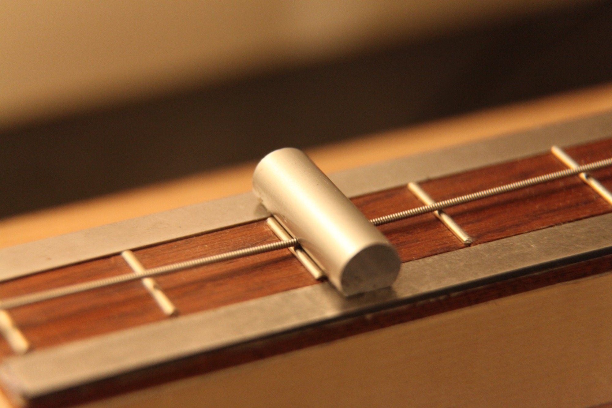
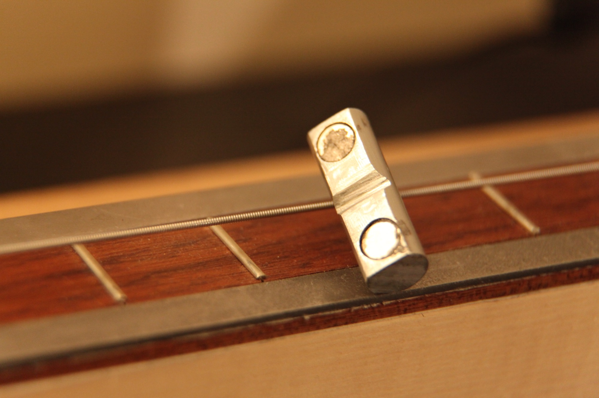
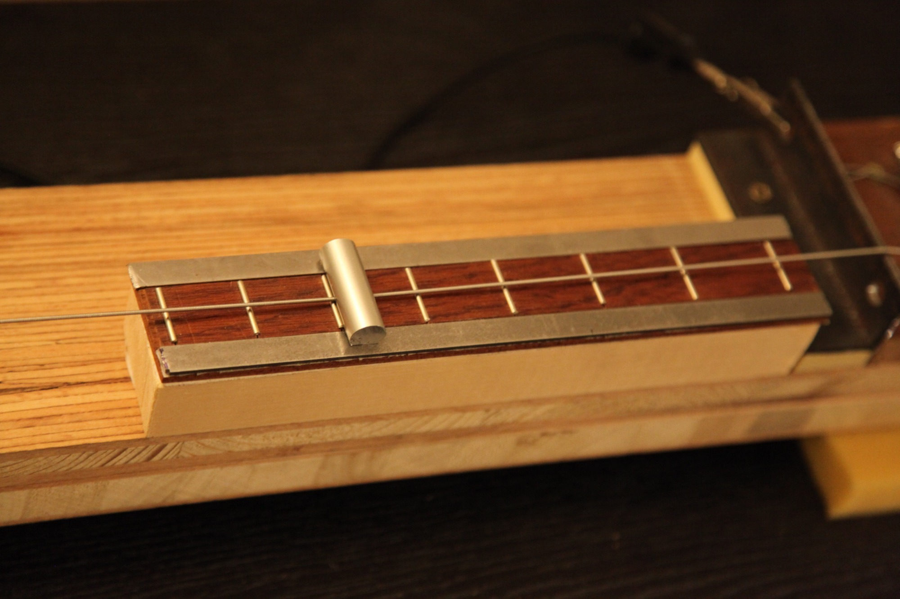

# Conclusion and future work

## Conclusion

Though the control over the system is still in an early phase, we have built the basis for a stringed instrument on which timbre is controlled via electromagnetic actuators.

We first chose a sensor that was adapted to our magnetically noisy setup, the piezo pickup, and then studied the actuator design using simulations and semi-quantitative analysis. We built a test setup in the form of a one-string instrument with a specialized microcontroller and a custom amplifier.
To improve our understanding of the fields of our actuators, we built a low-cost magnetic field scanner using a CNC mill as a base.
We designed an efficient algorithm to compute the Fourier coefficients of the pickup signal, the output amplitude serving for the state vector and the output phase for the phase lock.
We compared the results of a simple model to actual data generated by the algorithm in open loop, and then started working on a proportional control of the system.
As a proof of concept, we also applied the results of the magnetic scanner for linearising the actuators effect, with interesting results.

## Future work

- It is clear that the next step is to test the control algorithm on other modes, and extend the proportional control to a well tuned PID. We also wish to try the model-free approach (or _smart PID_) proposed by @@7330852 .
- The placement of the actuator has not yet been explored, and we did most experiments at a single position. We also anticipated adding a second actuator to reach other modes that might be unaccessable due the comb filter effect of the string.
- Though the motion of the string is known to be naturally both horizontal and vertical, in most experiments we assumed that the horizontal displacement was negligeable. Additional work will show if the effect of the actuator can be tailored to have a mostly vertical vibration.
- Once a suitable control algorithm has been tried and tested, we wish to build the real version of this instrument, named _The Controlled Sitar_, hence the name of this report. The wood type, general aesthetics, materials and casing design have already been decided.
- The human interface and expression language aspects of this project are still entirely to explore. A probable next step is to try to control the system using an off-the-shelf Leap Motion sensor and a simple mapping algorithm.
- Though the instrument is mainly a timbre-oriented instrument, we also want to add certain melodic capabilities. We quickly milled a fretboard with steel rails that  is used with a custom magnetic capo. The string is pulled onto the frets because of the force of the permanent magnets that are on the edge of the capo. Additional work is needed to get the right material for a stable note at high amplitudes (the capo can be ejected if the energy of the string is too great) and comfortable play (the capo is meant to be easily and quickly detached).

