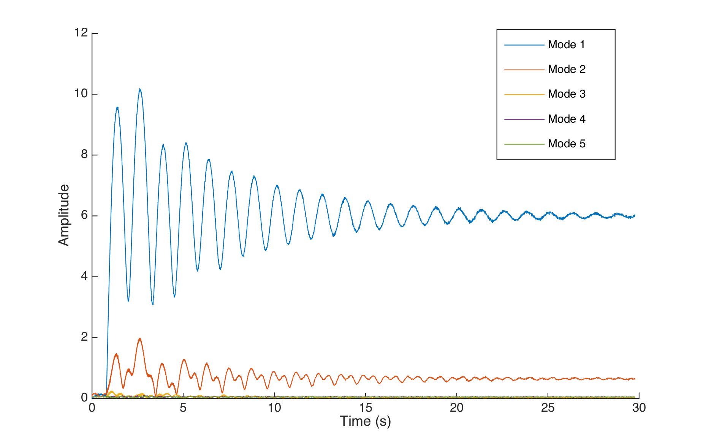
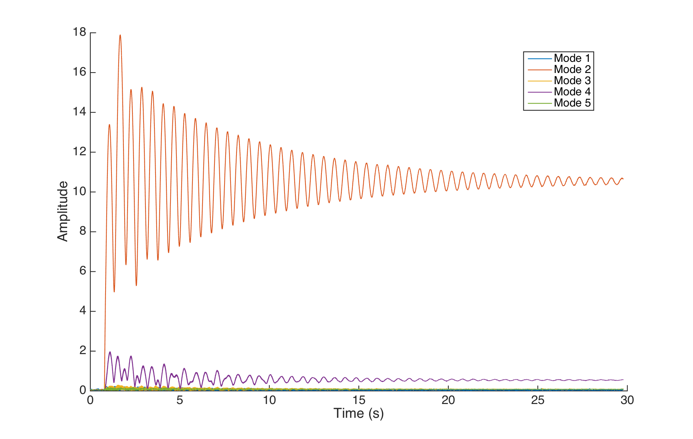
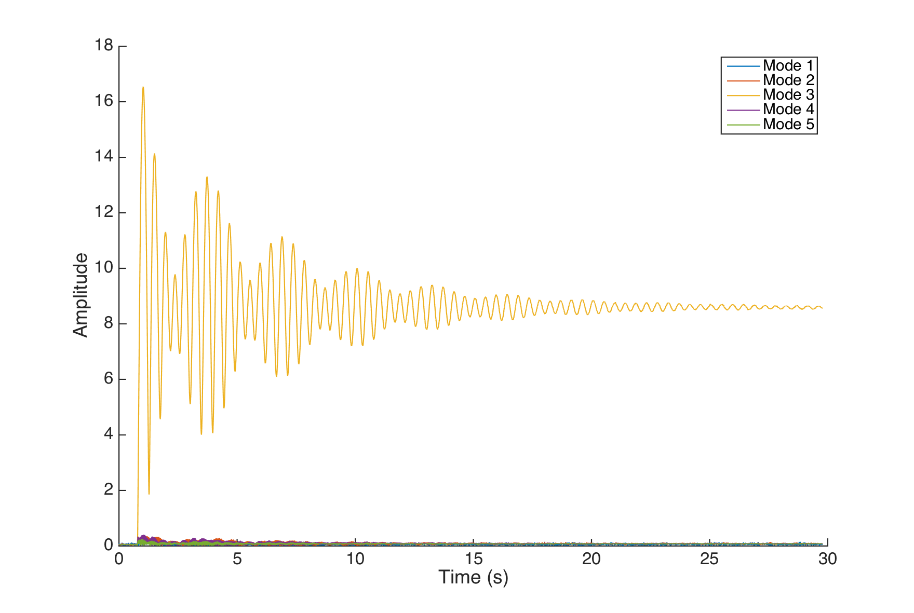

# The dynamics of the system

## Summary

We started using a simple model, the damped string model. It exhibits an important property of the system : the relaxation and max stimulation frequencies are different, making the tuning of the system more complex.

The model predicts a first order response on the amplitude of each mode, when the drive frequency is _exactly_ the resonant frequency, and predicts beatings when the difference is small. Experimental open loop data indeed shows strong beatings, but their dynamics are complex.

_This simple model, which parameters seem too dependent on the environmental conditions of the instrument, was not used in the experimental control, and we did not manage to get a clear differential equation describing the system as defined._

## Calculations 

### The homogeneous equation

We started with a very simple model of this instrument : the damped string, in one dimension.

Let $u(x,t)$ be the height of the string above its resting position at position $x$ and time $t$.  We can write the damped string equation $$u_{tt} - c^2 u_{xx} + \lambda u_t = 0 \quad(1)$$. with boundary conditions $u(0) = u(L) = 0$. Supposing $u$ is harmonic and can be written as $u(x,t) = f(x) \, g(t)$, we find $f''(x) = k \,f(x)$ and $g''(t) + \lambda g'(t) = c^2 k g(t)$. The asymptotic stability imposes $k<0$, hence $k = - \alpha^2$

The boundary conditions impose $f(0)=f(L)=0$, hence $f(x) = A \sin(\alpha_n x)$, with $\alpha_n L = n \pi$. e.g. $\alpha_n = \frac{n\pi}{L}$. The solutions of  $g''(t) + \lambda g'(t) + c^2\alpha_n^2 g(t) = 0$ are $t\mapsto B\exp(\beta t)$ with $\beta\in\mathbb{C}$ and $B\in\mathbb{R}$. Re-injecting in the previous equation, we find $\beta^2 \exp(\beta t) + \lambda \beta \exp(\beta t) + c^2 \alpha_n^2 \exp(\beta t) = 0$ hence $\beta^2 + \lambda\beta + c^2\alpha_n^2 = 0$. The real system oscillates with little friction, so we can assume that $\lambda - 4c^2\alpha_n^2<0$.

Hence $$\beta = \frac{-\lambda\pm j\sqrt{4c^2\alpha_n^2 - \lambda^2}}{2}=\frac{-\lambda}{2} \pm j\sqrt{c^2\alpha_n^2 - \left(\frac{\lambda}{2}\right)^2}$$ 

Let $\omega_{0,n} = \frac{c \,n\,\pi}{L}$, thus $$\beta  = \frac{-\lambda}{2} \pm j \omega_{0,n}\sqrt{1 - \left(\frac{\lambda L}{2cn\pi}\right)^2}$$ . 

We will also call $$\omega_{u,n} = \omega_{0,n}\sqrt{1 - \left(\frac{\lambda L}{2cn\pi}\right)^2}$$ the pseudo-frequency of undriven oscillations.

Now solving the general solution, we had  $f_n(x) = A \sin(\alpha_n x)$. We suppose $A = \frac{L}{\sqrt{2}}$ (since constants can be adjusted to boundary conditions later). Since $(f_n)_{n\in\mathbb{N^*}}$ is an orthonormal basis of the Hilbert space  $L^2(]0,L[)$, we can write  $$u = \sum_{n\in\mathbb{N^*}} g_n(t) f_n(x) = \sum_{n\in\mathbb{N^*}} g_n(t) \sin\left(\frac{n\pi}{L}x\right)$$.

The linearity of the wave equation and the orthogonality of the $(f_n)_{n\in\mathbb{N^*}}$ gives $g_n''(t) + \lambda g_n'(t) + c^2\alpha_n^2 g_n(t) = 0$ and so $g_n = B_n \exp(-\frac{\lambda}{2}) \sin(\omega_{l,n}t + \phi_n)$.

Hence the general form of the homogeneous equation :

$$u = \sum_{n\in\mathbb{N^*}} B_n \exp\left(-\frac{\lambda t}{2}\right) \sin(\omega_{l,n}t + \phi_n)\sin\left(\frac{n\pi}{L}x\right)$$

### Adding the actuator

Let us now consider the non-homogeneous damped string equation : 

$$u_{tt} - c^2 u_{xx} + \lambda u_t = h(x,t) \quad(2)$$.

where $h : ]0,L[\times \mathbb{R}^+ \to \mathbb{R}$ is a smooth function that can be written as $h(x,t) = d(x)s(t)$  (the actuator does not move). 

Projecting $h$ on the $(f_n)_{n\in\mathbb{N^*}}$ basis gives  $$h(x, t) =  \sum_{n\in\mathbb{N^*}} s(t) \,k_n\sin\left(\frac{n\pi}{L}x\right)$$, where $k_n \propto <f_n,d>$.

The $c_n$ scalars represent the spatial distribution of the force, while $s(t)$ represents its time dependent variations.

Equation $(2)$ yields  $$\sum_{n\in\mathbb{N^*}} \left(g_n''(t) + \lambda g_n'(t) + c^2\alpha_n^2 g_n(t) \right) \sin\left(\alpha_nx\right) =  \sum_{n\in\mathbb{N^*}} s(t)\,k_n \sin\left(\alpha_nx\right)$$. 

Hence $g_n''(t) + \lambda g_n'(t) + c^2\alpha_n^2 g_n(t) =  k_n \, s(t)$, since the $(f_n)_{n \in \mathbb{N*}}$ are orthogonal.

In complex notation, we get

$(j\omega)^2\underline{g} + j\omega\lambda\underline{g} + \omega_{0,n}^2\underline{g} = k_n \underline{s}$  hence $$\underline{g} = \underline{s}\frac{k_n}{\omega_{0,n}^2-\omega^2 + j\omega\lambda}$$

This is the typical behaviour of a second order low pass filter with a resonant frequency  $\omega = \omega_{0,n}$.

The simulations of cylindrical permanent magnets and the magnetic scans are consistent with a simplification of the force of the type : 

$$d(x) =  \bigg( \begin{matrix}  0 \text{ if } x \notin [x_0 -\frac{\delta x}{2},x_0 +\frac{\delta x}{2}] \\ \frac{d_{max}}{(\frac{\delta x}{2})^2}(x-(x_0 -\frac{\delta x}{2}))(x - (x_0 +\frac{\delta x}{2})) \text{ otherwise}\end{matrix}$$.

This definition is that of a parabola centered around $x_0$, with a max height of $d_{max}$ and a distance between its roots of $\delta x$. The function is zero outside of $[x_0 -\frac{\delta x}{2},x_0 +\frac{\delta x}{2}]$, hence out of the bell region.

We can now calculate $k_n$ : 

 $$k_n \propto < f_n, d> \;= \int_0^L \sin\left(\alpha_n x\right)d(x) \; \text{d}x =   \int_{x_0 - \frac{\delta x}{2}}^{x_0 + \frac{\delta x}{2}}\sin\left(\alpha_n x\right)d(x) \; \text{d}x$$ $$k_n\propto \left( \frac{2}{\alpha_n^3}\left(\delta x\alpha_n\cos\left(\frac{\delta x \alpha_n}{2}\right) - 2 \sin\left(\frac{\delta x \alpha_n}{2}\right)\right)\sin(\alpha_n x_0)\right)$$

But for small actuators, this result is close to the one we would get from the single point model : $k_n \approx c' \sin(\alpha_n x_0)$. We found experimentally that both predictions were far from actual amplitude data : the final amplitude values of modes tested in open loop had very different ratios than xhat the formula predicted.

It is important to stress that we are interested in the dynamics of the __amplitude of each mode__ ($C(t)$ as introduced in the [state sensor algorithm page](/state_sensor_algorithm)), not just the state of its associated oscillator.
For a Heaviside excitation at the resonant frequency, i.e. $s(t) = u_0(t)A \sin(\omega_{0,n} t)$  (where $u_0(t<0)=0$ and $u_0(t\geq0)=1$), the system behaves like a first order system (regarding the amplitude) : the final state is reached with an exponential decay profile. The time constant is $2/\lambda$, like in the homogeneous equation.
We can thus hypothesise that the system behaves like a first order system for more complex excitations, if exactly driven at its resonance frequency.

 ](../img/img478.png)

Except in the simple case of the undamped string, we were unable to analytically compute a simple expression for the amplitude of the transient response when the frequency is not exactly $\omega_{0,n}$ (even with the help of _Mathematica_). We also had trouble finding literature on the subject (and would welcome any documentation sent to us).

We expected beatings similar to a second order response, but we came to the conclusion that we needed experimental data to continue.

](../img/img500.png)

### Testing the simple model

We collected a set of data representing the system response to different step inputs.

We used the Bela to inject a signal of the type : 

$$s(t) = r(t)\left(\sum_{i=1}^5 a_i\sin(w_i (t-1))\right)$$ where $t\mapsto r(t)$ is a ramp signal defined as

$r(t) = \Bigg( \begin{matrix} 0 \text{ if } t<1  \\ (t-1)/D \text{ if } 1\leq t \leq 1+\epsilon \\  1  \text{ if } t>1+\epsilon \end{matrix}$ And phases were chosen so as to limit the high frequency click at $t=1$.

The $a_i$ amplitudes were chosen to study both single frequency response and multimodes excitation.

The actuator was placed at 120mm from the sensor (the string has a length of 700mm).

The below figure shows the system response to a `0.5` step input for mode 1.

The decay of the beatings has an exponential profile, but the beginning of the transient is difficult to analyse. The same observation can be made on the open loop response to a mode 2 step (though the decay is too slow to be exponential): 

However, the beatings become more complex for mode 3 onward : _the beatings start to have a beating oscillation_.

The modes are also more coupled than anticipated, and the beatings change accordingly. We tried to use the system identification toolbox in Matlab to get a numerical model that could explain these responses, but even with high order models, we could not get better than a 70% fit, and most often the begining of the transient was fairly off.

In front of these difficulties to get a reliable model, we resorted to first control the system with a model-less controller like a PID, before resuming the model construction with better knowledge of the system behaviour.

### The issue of tuning the string

Tuning the string to an exact frequency is a difficult process : as seen previously, the free oscillation frequency differs from the resonance frequency, and this relationship depends on the damping of the system. The string being attached to other mechanical parts (the piezo bridge, the nut and the tuning mechanism, and the wood itself), the damping is a function of the entire instrument geometry. Furthermore, the surface on which the instrument is played also dissipates energy, as it radiates sound.

To mitigate the surface dependancy, we layed the instrument on thick foam legs, dramatically reducing the transmitted vibration.

We used stroboscopy to tune the string : we injected a pure sine at a fixed frequency into the actuator, and then used an LED array driven at the same frequency to see the actual movement of the string.

We also reduced the illumination time to a tenth of the period the fundamental : this reduced motion blur and allowed finer tuning.

We were constantly confronted with a kind of hysterisis : the string would start its vibration when driven at a frequency close to $f_0$, but would still vibrate, sometimes with a higher amplitude, when driven at a frequency further off from $f_0$.

Our method for tuning was to regularly stop the string and wait for the amplitude to settle, while checking the frequency with the strobe. 
