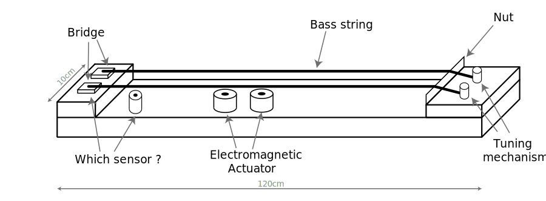

# General geometry of the instrument

Our stringed instrument is inspired from the lapsteel and the Chinese Guzheng : it has  a long, thin body of wood and it is played on a table. It uses two bass strings under which electromagnetic actuators are placed.

The following figure summarizes the shape of the instrument.

The exact choice of the actuators is detailed in the [next section](/general_actuators).