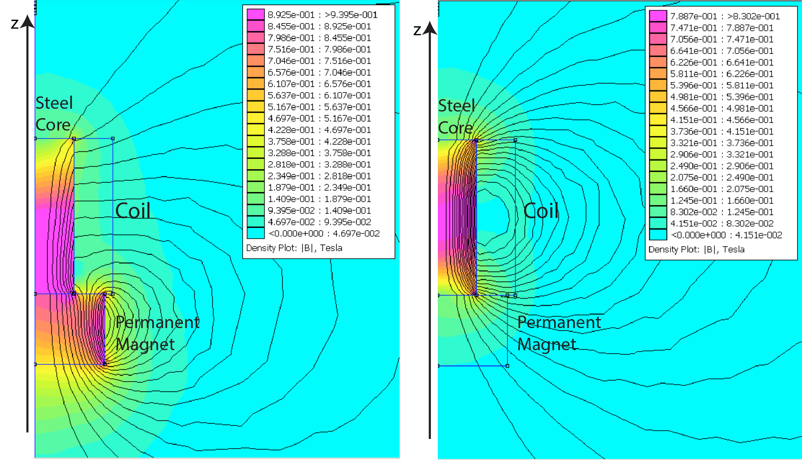
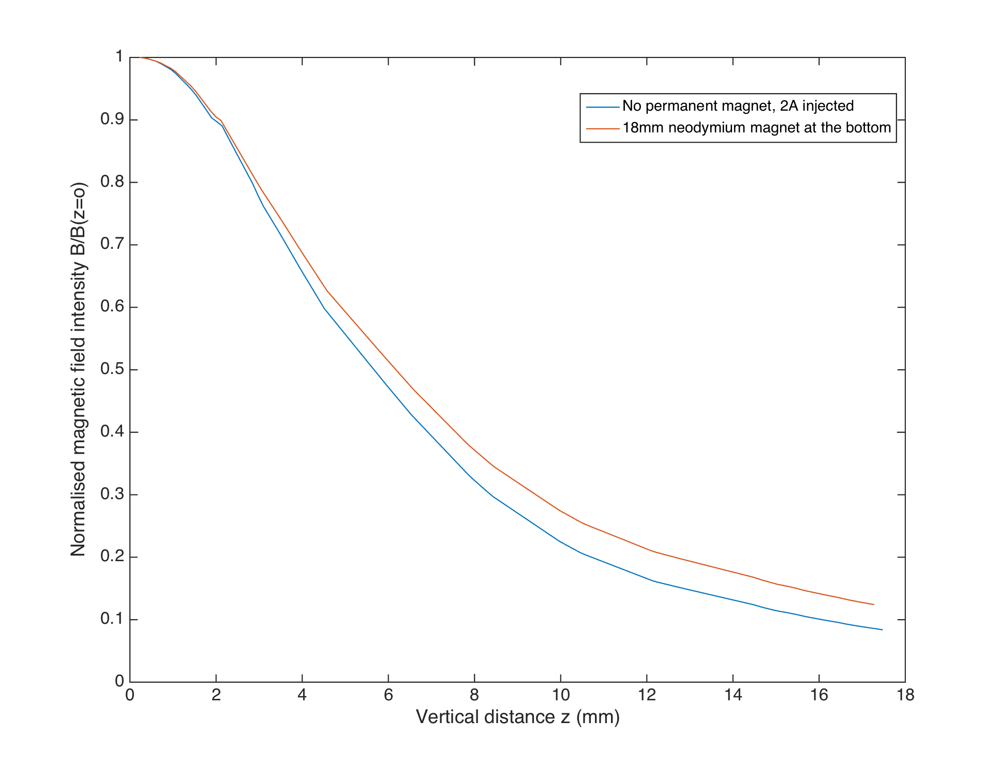
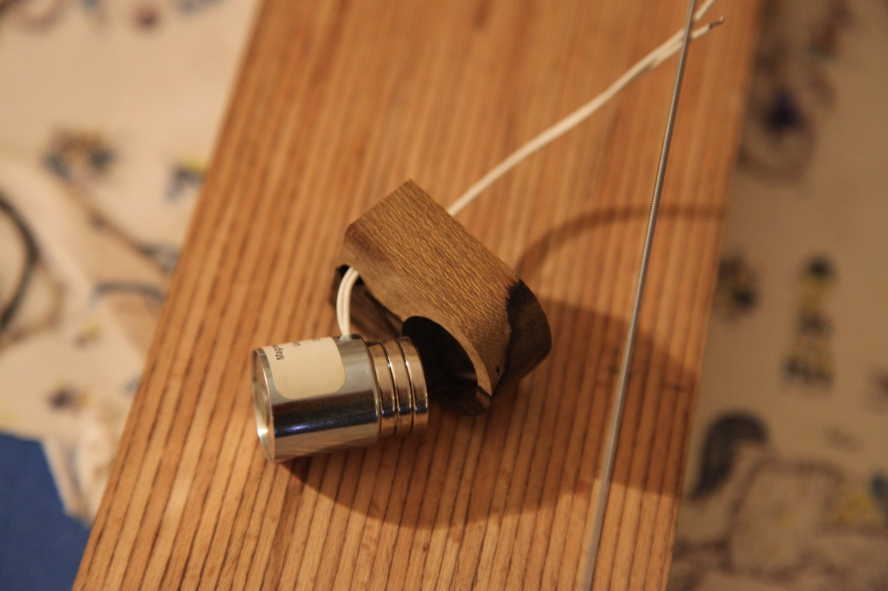
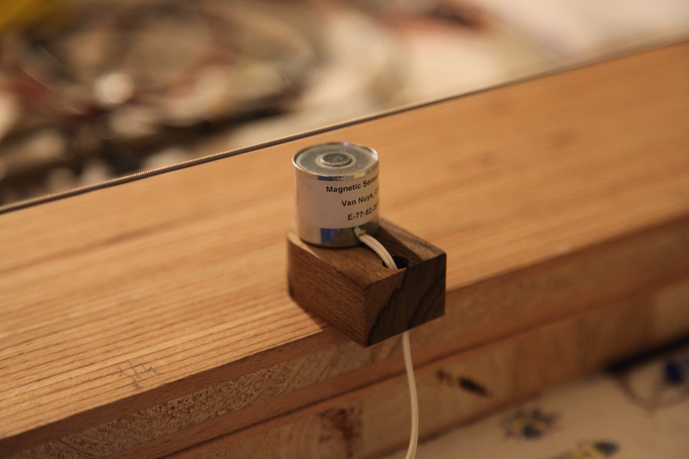
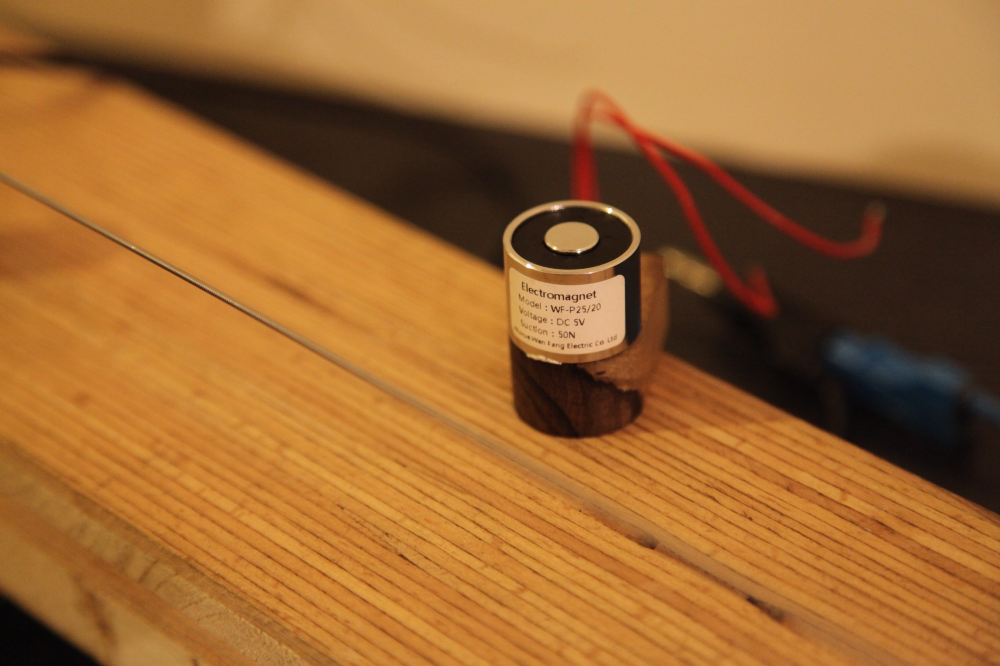

# The actuator

Using electro-magnets for driving strings in musical instrument si not new, dating back to 1886 when Eisenmann@^van2017between built a piano sustainer using such magnets.

Many other augmented instruments have used the electromagnet to induce or control vibrations in strings or other magnetic objects : the Electromagnetically Prepared Piano@^Berdahl2005, the Magnetic Resonator Piano@^McPherson2010 or the EMvibe@^Britt2012, the [Vo-96](http://www.paulvo.com/vo-96/) ; numerous electric guitar sustainers exist on the market, including the E-Bow@^heet1978hand and the [Wond](http://www.paulvo.com/wond/).

The decision to use this type of actuators was a defining choice for the instrument, made before the research actually began.

### General principle

The physics of this type of actuators is ruled by the Maxwell equations in matter, the response curves of ferromagnetic materials and Faraday's law (which are consequences of Maxwell equations).
A typical electro-magnet consists of a coil of copper wire insulated by a thin coat of resin. In the middle of the coil is usually an iron cylindrical core which can guide the magnetic field when a current is injected in the coil.
Injecting a current in the coil creates a magnetic field which magnetises the ferromagnetic string above it. The string, having now a magnetic moment, experiences a force due to the magnetic field gradient, pulling it towards the electromagnet.


The shape of the electromagnet is dictated by the desired number of wire turns $N$ in the coil, the thickness of the wire and the diameter or height of the assembly. Increasing the thickness of the wire decreases linear resistance and makes the coil less sensitive to insulation melting failure; at constant volume, $N$ is of course reduced, decreasing the DC field intensity.

A. McPherson provides a very convenient guide@^McPherson2012 for choosing the right electro-magnet for augmented instruments, using his Magnetic Resonator Piano as a reference.

### A first optimization

Let $d_{out}$ , $d_{in}$,$h$, $d_{wire}$, $\rho$  be respectively the outside diameter of the coil, the inside diameter of the coil, the height of the coil, the diameter of the wire and its resistivity (we will neglect the extra thickness due to the insulation around the wire).

As pointed by McPherson, we need to have a high $NI$ product to get a high intensity field.

Our constraints are the geometry of the electromagnet and the capabilities of our amplifier : both the current $I$ and the voltage $U$ are limited (hence, $I<I_0$ and $U<U_0$).

Working first in DC current, we can write Ohm's law $U = RI$. We can write $R$ as a function of the parameters : 

 The number of turns is $N = \frac{(d_{out}-d_{in})}{2d_{wire}}\frac{h}{d_{wire}}$  and the average circumference is $\pi \frac{d_{out} + d_{in}}{2}$, so the total length is $l = \frac{(d_{out}^2-d_{in}^2)\pi h}{4d_{wire}^2}$. The resistance is therefore $R = \frac{(d_{out}^2-d_{in}^2)\pi h}{4d_{wire}^2}\frac{4\rho}{\pi d_{wire}^2} =  \frac{(d_{out}^2-d_{in}^2) h\rho}{d_{wire}^4}$. 

At $U=U_0$, we want $I = U_0/R \leq I_0$  which means $\frac{U_0d_{wire}^4}{(d_{out}^2-d_{in}^2) h\rho}\leq I_0$.
With a given geometry (hence $d_{out} , d_{in},h$  are fixed), we get an upper bound for $d_{wire}$ : 

$$d_{wire} \leq \sqrt[4]{\frac{h\rho (d_{out}^2-d_{in}^2)I_0}{U_0}}$$ and since we want to maximize $NI=  \frac{h(d_{out}-d_{in})}{2d_{wire}^2}\frac{U_0d_{wire}^4}{(d_{out}^2-d_{in}^2) h\rho} =  \frac{U_0d_{wire}^2}{2\rho(d_{out}+d_{in})}$ , we want to maximize $d_{wire}$.

Therefore, for a given geometry and amplifier, at DC current, it is optimal to have $$d_{wire} = \sqrt[4]{\frac{h\rho (d_{out}^2-d_{in}^2)I_0}{U_0}}$$.
This approach is simply a form of impedance matching, between the amplifier and the magnetic field.

### The cylindrical core

In low intensity fields, a ferromagnetic material can be considered linear (see table below), hence $\overrightarrow{H}=\frac{1}{\mu_0\mu_r} \overrightarrow{B}$, and inside an infinite solenoid we get 

$B = \mu_r \frac{\mu_0 N}{l}I$ (ref cours Sornette)

Hence, the ferro-magnetic core passively amplifies the field generated by the coil. [^Energy is conserved, since the coil must provide additional power to rise to the amplitifed field : the inductance of the coil becomes $L = \mu_r \frac{\mu_0 N^2S}{l}$.]

To maximize the field above the coil, we want to choose a material with a high $\mu_r$ : One of the metal with the highest $\mu_r$ is a special alloy called µ-metal, but it is very expensive as a bulk material, and it is usually used as a shielding sheet.
Another attractive material is soft-ferrite, but ferrites tend to saturate at very small magnetic field intensities making them unsuitable for anything but small electro-magnets (or signal filtering).
Finally, pure iron and some steels have a high $\mu_r$ (though lower than that of ferrite at low $B_0$) and have a high magnetic saturation limit. Additionally, steels have reasonable thermal conductivities, making it easier to evacuate the heat generated by the surrounding coil.

```R
    Soft iron               Ferrite (TDK PE22)             MuMetal                    
  B         MuR               B         MuR             B         MuR                        
(tesla)                    (tesla)                   (tesla)                 
==================          ==================       ====================                        
0.0000   4075.4511          0.000     5704.912         0.0000   73398.5246                        
0.8944   3768.2831          0.077     5633.436         0.0722   73398.5246                        
1.2000   3166.8099          0.160     5424.336         0.1444   77009.7382                        
1.4000   2380.6469          0.254     4781.793         0.2527   74441.0260                        
1.5000   1595.4230          0.353     3578.099         0.3068   72787.8064                        
1.5500    997.8273          0.385     2578.026         0.3249   71206.0556                        
1.6000    674.1631          0.405     1499.123         0.3610   68146.5021                        
1.6500    473.5731          0.419      778.228         0.3790   63014.8312                        
1.7000    319.4254          0.439      347.272         0.4332   48685.4716                        
1.7500    221.3841          0.465      129.890         0.4693   38841.3551                        
1.8000    173.2094          0.487       47.974         0.5054   28360.2248                        
1.8500    139.9732          0.527       16.847         0.5415   17641.2071                        
1.9000    113.0668          0.599        6.883         0.5595   12919.5326                        
1.9500     90.6347          0.687        3.903         0.5775    9452.6909                        
2.0000     73.9636          0.815        2.640         0.6315    2244.9895                        
2.0500     60.9549          1.015        1.976         0.6489     807.5867                        
2.1000     51.1983          1.229        1.720         0.6624     178.6407                        
2.1250     44.2498          1.422        1.574         0.6693      66.6538                        
2.1500     38.2875          1.622        1.478         0.6825      29.9372                        
2.1750     32.4063          1.782        1.423        20.0000       1.0343                        
2.2000     25.9244          1.978        1.371                               
2.2500     19.6678          2.175        1.303                               
2.2797     15.2170          2.349        1.255                               
2.3069     12.3584          2.494        1.239                               
```

The above table sums up the relative permabilities of Soft iron, ferrite and µ-metal. Data from the [Field Precision LLC website](http://www.fieldp.com/magneticproperties.html#MuMetal).

Therefore, most holding electro-magnets have a steel core, and an outer steel ring that also helps focusing the field.

Even with a simple geometry and simplifying assumptions like linear magnetic properties, the field generated by a thick finite solenoid _wound around a steel core_ is difficult to get analytically. There is however extended litterature on the field generated by thick solenoid and permanent magnets : @@Walled1979 or @@Ravaud2010 detail complete formulae.

We used a free simulation program [FEMM](http://www.femm.info/wiki/HomePage), commonly used in magnetostatics, to visualise the field.

### Force on the string

Most guitar and piano strings are made in part of steel, which can be considered a magnetically linear material here. (see table above)

When exposed to an external magnetic field $\overrightarrow{H_{ext}} = \frac{1}{\mu_0} \overrightarrow{B_{ext}}$, the string reacts with a field $\overrightarrow{B_{string}}=\mu_0\mu_r \overrightarrow{H_{ext}}$ (inside the string).

The exact formula for $\overrightarrow{B_{ext}}$ is complex and greatly depends on the geometry of the actuator and the materials used, but we can still use a semi-quantitative approach to get some results : 

Since the string is small compared to the variations of $\overrightarrow{B_{ext}}$, we will assume the magnetic moment is constant accross the section of the string. This magnetic moment per unit of length is simply $\overrightarrow{m\,} (x,y) = S_{\text{string}} \mu_0 \mu_r \overrightarrow{H_{ext}}(x,y)$

$\overrightarrow{B_{ext}}$ is not uniform and its magnitude is stronger near the coil. 

The force acting on a section of the string is 

$\overrightarrow{f(x,y, z)} = \overrightarrow{\nabla\,}(\overrightarrow{m\,} \dot{} \overrightarrow{B_{ext}}) = \overrightarrow{\nabla\,}(  S_{\text{string}}  \mu_r \overrightarrow{B_{ext}}\dot{} \overrightarrow{B_{ext}}) = \overrightarrow{\nabla\,}\left(  S_{\text{string}}  \mu_r \left|\left|\overrightarrow{B_{ext}}\right|\right|^2\right)$

We are mostly interested in the projection of this force on the $z$ axis (and to a lesser extent, on the $y$ axis) in the axis of symetry of the cylinder.

Hence $f_z (x_0,y_0, z) = S_{\text{string}}  \mu_r  \frac{\partial}{\partial z} \left( B_x^2 + B_y^2 +B_z^2 \right)  = S_{\text{string}}  \mu_r  \frac{\partial}{\partial z} B_z^2  = S_{\text{string}}  \mu_r  \left(\frac{\partial}{\partial z}B_z\right) B_z$

$B_{ext}$ is directly proportional to the current in the coil, so $f_z \propto I^2$.

They are different approaches to get a more linear response. McPherson uses a DC offset@^McPherson2012 so that $f_z = \alpha (I_0 + I_{signal})^2 \approx \alpha( I_0^2 + 2I_0I_{signal})$. The offset is adaptative : an envelope detector sets $I_0$ so that $I_0 + I_{signal}$ is positive but not too high (to avoid overheating the coil).

Another approach used is to attach a permanent magnet to the electro-magnet assembly. This has the advantage of reducing the current injected (hence reduce the dissipated power), while also achieving intense fields, and it simplifies the amplifier circuit.

This approach is justified by the fact that the magnetic field created by the current running in the coil can be seen as a rotating surface current in the coil inner cylinder, and the same model describes permanent cylindrical magnets@^Ravaud2010. 
Since the steel core will canalises the magnetic field lines of the permanent magnet below it, we can expect the steel core to be magnetised like a permanent magnet (but with the added benefit of having a high $\mu_r$). FEMM Simulations proved this assumption to be reasonable for the typical fields used here : for the geometry of the electromagnet proposed by McPherson (see next paragraph), the fields _above the electromagnet_, generated either by injecting a current or adding a stack of neodymium magnets at the back, have a very similar decay profile.





Hence we can expect the addition of permanent magnets at the back of the electromagnet to be similar to a DC current offset in the coil. This is the approach we used for this instrument : below the electromagnets are strong neodymium magnets that generate the necessary offset.

### Sourcing the actuator

The MRP design uses a model of electromagnet that has become a reference among augmented instruments : the _E-77-82_ from [`ElectroMechanicsOnline.com`](http://www.electromechanicsonline.com/product.asp?pid=692). It is a cylinder with a diameter of 20.8mm and a height of 19.6mm, with a steel core  (diameter 7mm) and a steel outer casing (thickness 0.5mm). It has a resistance of around $5.5\Omega$ and an inductance of 19mH @^McPherson2012 , and approximately 1000 turns.

We added three 3mm thick neodymium magnets (grade N42, diameter 18mm) at the back, and quickly milled little wood pieces that would hold the magnet at a reasonable distance from the string (6mm). This distance was chosen after exciting the string with a sine at its resonance frequency, and changing the height to get a good amplitude of oscillation without having the string hitting the actuator.






For the geometry of this electromagnet and an amplifier with $I_0 = 1A$ and $U_0 = 10V$, the optimisation of the diameter of the wire gives $d_{wire} = 0.40 \text{mm}$ or in the American gauge system AWG26, which is close to the AWG28 that McPherson recommends . But since the expression uses a 4th-root, and since this optimisation neglects inductance, we mostly want the resistance to be in the range of $4\Omega$ to $15\Omega$, adapted to speaker amplifiers (typical expected impedance $8\Omega$).


These electromagnets being relatively expensive and made within a high DC resistance tolerance, we tried to find a more affordable alternative. We found that _Wuxue Wen Fang Electric Co Ltd_ makes electromagnets with similar characteristics, at a much lower price. These magnets are sold on `ebay.com` through various Chinese sellers. They seem to always have "0.8A 5V" in their listed name, but will call them using the printed name _WF-P25/20_. They have an outside diameter of 25mm and a height of 20mm, a 10mm diameter steel core, and a typical resistance of $7.0\Omega$.




> Note :  A quantitative comparison between the two electromagnets can be found in the [_magnetic scanner results_ ](/magnetic_scanner_results) section.


Having now suitable actuators for the instrument, we can move on to the [choice of the sensors](/choosing_sensors).