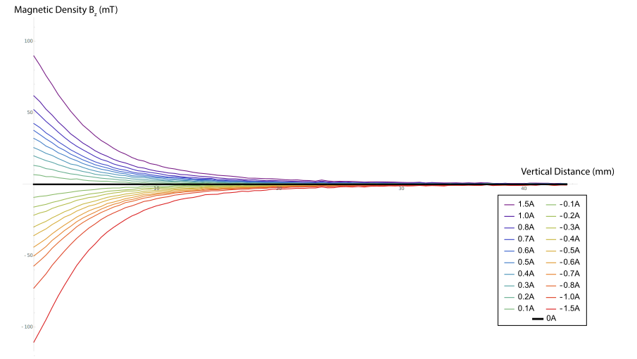
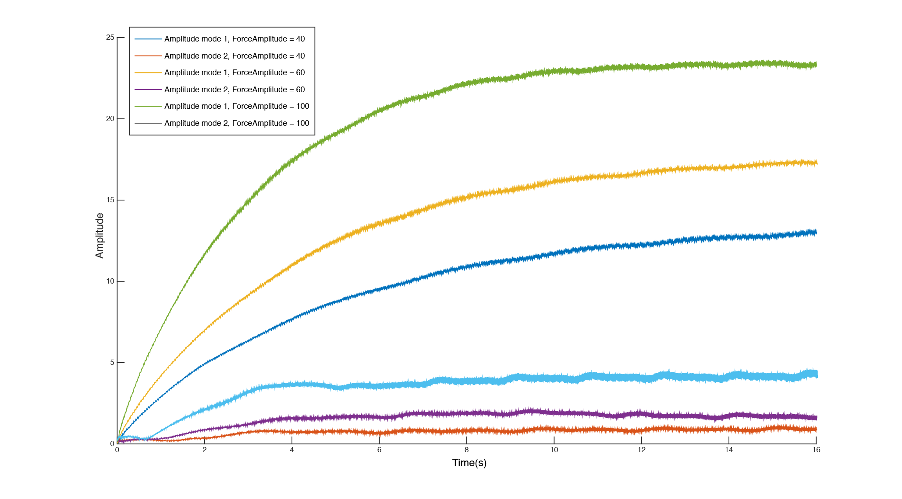

# Linearising the actuators

## Summary

As a proof of concept, using [scans from the magnetic scanner](/magnetic_scanner_results)  we derived an experimental formula describing the relationship between the force acting on the string, the distance of the string above the magnet and the applied current. We then used this formula and the output of the state sensor algorithm to linearise the force applied to the string.

After hand-tuning a few parameters, we managed to decrease the amplitude ratio between mode 2 and mode 1, but the shape of the response is still unexpected.

## Method

### Magnetic scans

During the open loop response tests, we saw that at high amplitudes, the coupling between modes could get significant : we could easily have mode 2 amplitude stronger than mode 1 amplitude even when only trying to excite mode 1.

To mitigate this effect, we tried to get an experimental formula describing the intensity of the field as a function of $z$ (the vertical distance between the actuator and the string) and $I$ (the current injected in the coil).

> This experiment was conducted using the _WF-P25/20_ electromagnet and not the _E-77-88_ simply for timing reasons, as the scans for the _WF-P25/20_ were made earlier in the project.

We acquired different vertical magnetic scans, varying the current each time by $0.1\text{A}$. 

By substracting the permanent field, we can also see that the relationship between $B_z$ and $I$ is roughly linear, as predicted.

The shape of the curves suggest an exponential decay model.

A `FindFit` in _Mathematica_ confirmed a very good fit with this model, leading to 

$B_{stat} = B_0 \exp{-k_0 z}$  and  $B_I=I b_I \exp{-k_Iz}$ .

Since the force acting on the string is mostly proportional to $B_z \frac{\partial B_z}{\partial z}$, we get 

$$  \alpha f = -   k_0 B_0^2 \exp(-2k_0 z)  - I B_0 b_I(k_0+k_I)\exp(-(k_0+k_I)z)  \\ - I^2 b_I^2k_I \exp(-2k_I z) $$ 

with numerical constants $B_0 =- 42 \; \text{mT}$,  $k_0 = 0.075 \;\text{mm}^{-1}$, $b_I = 62 \text{ mT A}^{-1}$, $k_I = 0.19\;\text{mm}^{-1}$.

For small currents ($I<0.3\text{A}$), the last term ($I^2 b_I^2k_I \exp(-2k_I z)$) is negligeable (smaller by a factor of 30).

Hence $$ I = \frac{\alpha f - k_0 B_0^2 \exp(-2k_0 z)} {B_0 b_I(k_0+k_I)\exp(-(k_0+k_I)z)} $$ is the current needed to impose a force $f$ on the string above the magnet.

To avoid using current when the string is at rest, we can take into account the natural offset of the system : 

$$ I = \frac{\alpha \hat{f} + k_0 B_0^2 \exp(-2k_0 z_0) - k_0 B_0^2 \exp(-2k_0 z)} {B_0 b_I(k_0+k_I)\exp(-(k_0+k_I)z)} $$

where $\hat{f}$ is the force applied to the string in addition to the static force of the permanent magnet at $z=z_0$.

Assuming the sensor is linearly sensitive to the vertical displacement of the string and insensitive to its horizontal displacement, the vertical position of the string above the magnet can be calculated using the ouput $C_n(t)$ of the state-sensor algorithm : 

$$ z = z_0 + \sum_{n=1}^{N} C_n(t)\gamma_n\sin(\omega_nt + \phi_n(t))$$

where $\gamma_n = \sin(n\pi x_0/L)$ is the geometric factor that represents the placement of the actuator at $x_0 = x$.

### The experiment

Knowing that the actual $\gamma_n$ coefficients would probably be off from the simple model, we connected the Bela system to a potentiometer array, each potentiometer setting a different parameter, with a range coherent with the predicted values.

For the first tests, we only tried to linearize the first two modes, so the potentiometers would modify $\gamma_1$ and $\gamma_2$, but also the voltage-current conversion ratio and the $z_0$, the height of the string above the magnet when the string is at rest, as we wanted to double check our measurements.

We excited the string with a constant sine (open loop), still using the phase lock from the state-sensor algorithm. 

After fine tuning the coefficients while monitoring the $\frac{|C_2(t)|}{|C_1(t)|}$ ratio, we found coefficients that allowed high amplitudes of mode 1 with less than 15% mode 2, compared to more than 120% at similar amplitudes in total open loop configuration.

### Interpretation and discussion

Plotting the system response showed a first-order-like response for one excitation, but  the time constants were quite different. A 5-pole no zero continuous transfer function proved showed remarquable fit (98%) with all collected data, while lower order transfer functions were far less accurate.
However, we expected a simpler second order model with beatings, closer to the simple damped string model response.
We do notice a significant reduction in the $\frac{|C_2(t)|}{|C_1(t)|}$ ratio but further testing with more modes is necessary to bring a complete conclusion as to the efficiency of this method for the linearisation of the actuators. We also fear that the decreased mode 2 amplitude can be due to the algorithm acting as a negative feedback mechanism on mode 2, since the mode 2 amplitude is part of the equation to compute $I$. This which might later interfere with the control process.

Moreover, we still need to try the same experiment with the _E-77-88_ electromagnet.

We still believe this proof of concept shows an interesting method of linearising actuators using magnetic scanning techniques.

