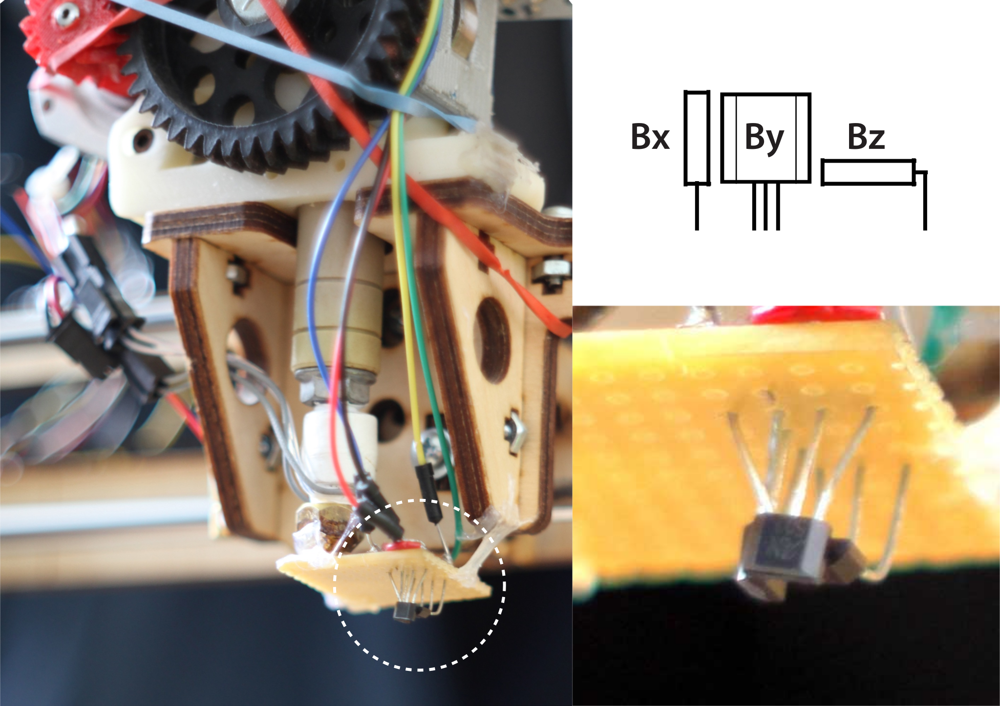
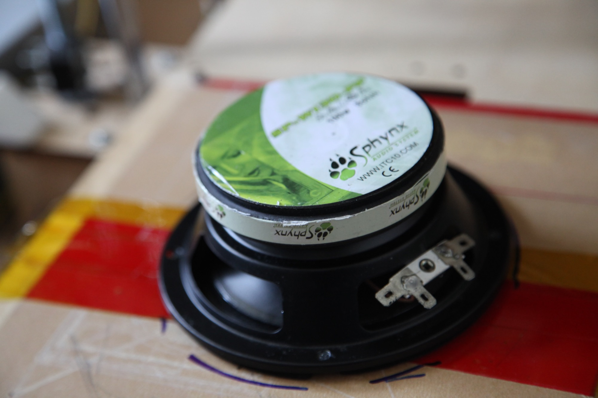
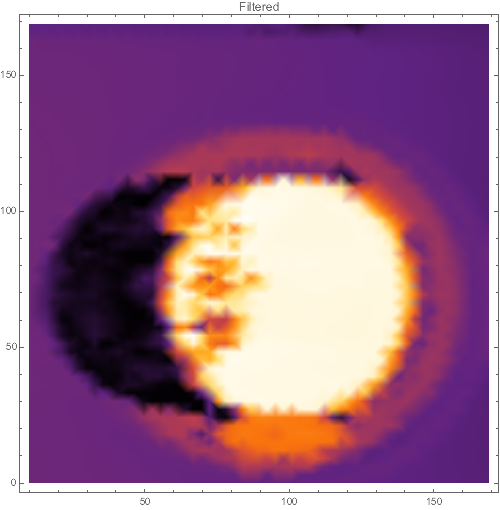
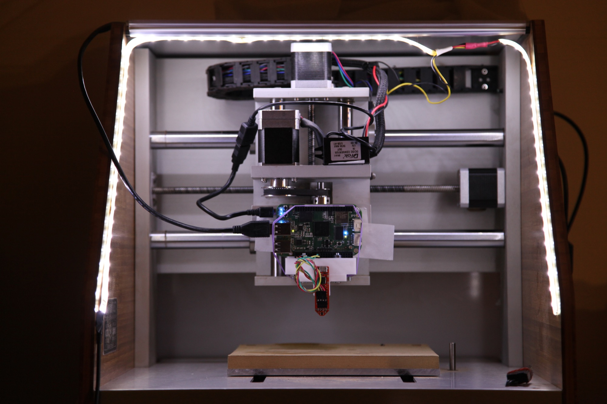
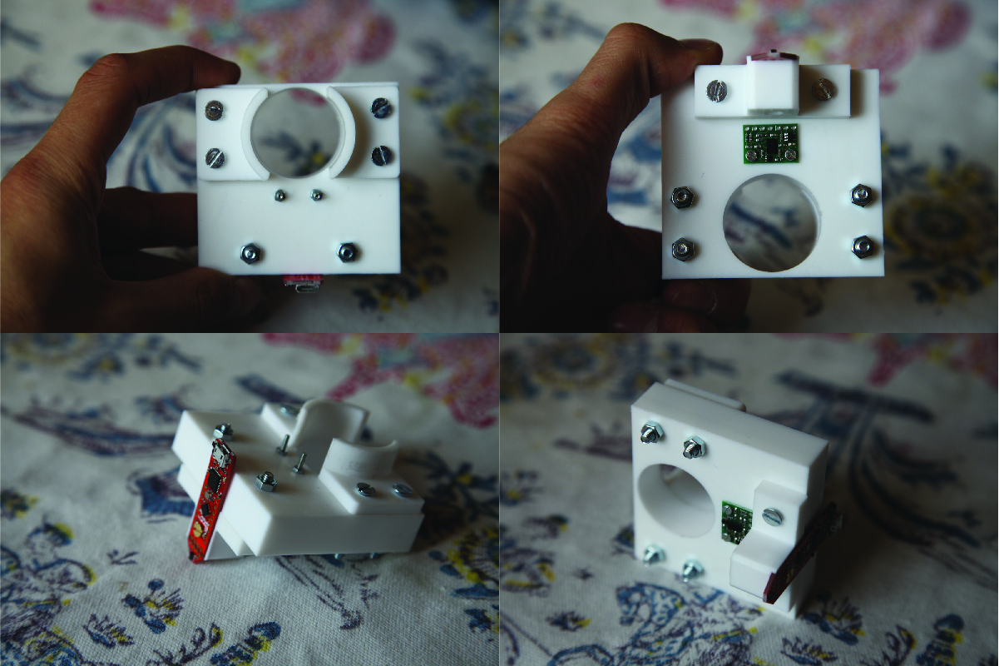
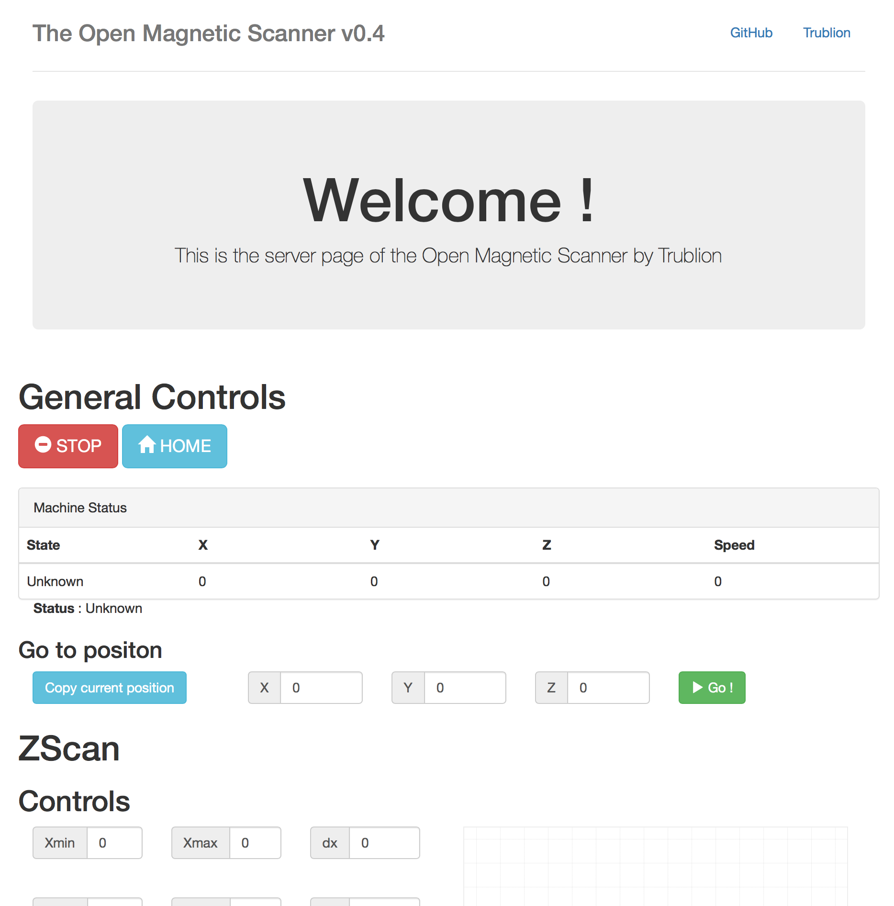
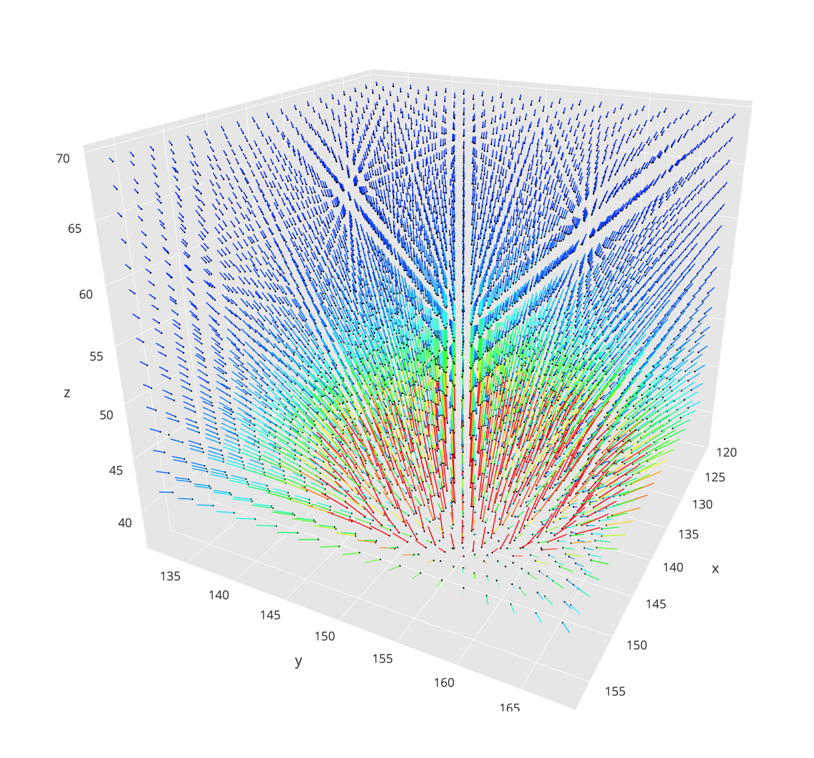

# An Open Magnetic Scanner : Design 

## Summary

To better undestand the magnetic field of our actuators, we built an open source magnetic scanner using off-the-shelf Hall effect and proximity sensors, and a CNC mill with custom parts. The scanner is autonomous and emits a webserver interface for controlling it wirelessly.

## Design and construction

### The first version

In 2014, we was given a *PrintrBot* 3D printer (a computer controlled machine that can move freely in a 3D space), on which we attached three Hall-effect sensors and an Arduino microcontroller for data logging. Hall-effect sensors produce a voltage proportional to the magnetic flux running through their surface; three small orthogonal sensors are enough to reconstruct the magnetic flux density vector $\overrightarrow{B\,}$ at a given point.

The result of this modification was a surprisingly effective magnetic scanner, given the makeshift quality of the sensors assembly and the low resolution of the Arduino ADC.

.jpg)

A python script was written to control the printer and collect data from the Arduino.

The printer would sweep a specified 3D area according to a precalculated grid. At each stop, the computer would ask the Arduino for new data, which it would store in a CSV file.

The data was then processed in *Mathematica* (a math processing software similar to *Matlab*). This scanner was used in a project to see the effect shielding has on a common loudspeaker.

These videos are some of the collected scans. The scanned object is a large speaker that can be seen on the next photo.

<video controls><source src="media/SphinxMediumNoShieldX.mov" type="video/mov"><source src="media/SphinxMediumNoShieldX.mp4" type="video/mp4"><source src="media/SphinxMediumNoShieldX.webm" type="video/webm"></video>

<video controls><source src="media/SphinxMediumNoShieldY.mov" type="video/mov"><source src="media/SphinxMediumNoShieldY.mp4" type="video/mp4"><source src="media/SphinxMediumNoShieldY.webm" type="video/webm"></video>

<video controls><source src="media/SphinxMediumNoShieldZ.mov" type="video/mov"><source src="media/SphinxMediumNoShieldZ.mp4" type="video/mp4"><source src="media/SphinxMediumNoShieldZ.webm" type="video/webm"></video>

To better vizualise the mapped magnetic fields, we wanted to add a 3D image of the scanned object.

We added a rudimentary 3D scanner, using a tilted laser and a USB camera. The printer would sweep the surface of a plane while the camera feed was analysed by `OpenCV` to find the bright spot of the laser. The coordinates of the spot were mapped to height values using simple trigonometry and a 3D map was reconstructed. The results showed ressemblance to the scanned object but were too sensitive to changes in reflectivity of the surface of the object. Moreover, tilting the camera or the laser means a shadow exists in the resulting image.

## The new version

In 2016, we acquired a desktop precision CNC mill, the *Nomad883* from *Carbide 3D*, which serves as a basis for the new version of the scanner.

It uses a BeagleBoneGreen Wireless microcontroller, with a `TLV493D` 3D magnetic sensor from *Infineon*, and a `ST_VL6180` proximity sensor from *ST* for z-mapping.

The proximity sensor is used to locate the object in the scanning area, and add a 3D map of the object to the magnetic field.

The BeagleBone emits a local webserver (using `Flask` and `SocketIO`) that serves as an interface for controlling the scanner.

The BeagleBone and both sensors are fixed onto a custom support part, with brass screws.

#### Mechanical parts

We used a piece of Delrin polymer, a heavy, white opaque, very tough plastic that we found in the small shop of the school.

The parts were machined using a 3.17mm carbide end mill using our CNC mill.

The plans were inspired by a dust shoe design posted on the [forum of the machine](http://community.carbide3d.com/t/nomad-883-pro-dust-head/1418). The assembly is secured onto the spindle of the machine using a hose clamp. The magnetic sensor is held in a channel via a brass screw and a nut.

The plans were drawn in *Illustrator*, since the proprietary software of the machine is more adapted to 2D plans in SVG format.

Here is a quick video of the milling process : 

<video controls><source src="media/milling.mp4" type="video/mp4"><source src="media/milling.webm" type="video/webm"></video>

####  Choosing the magnetic sensor

Several multi-axis magnetic sensors are available on the electronics market. Our choice was a compromise of 

- **Magnetic range** : The sensor must not saturate in the relatively high intensity fields of neodymium magnets

- **Orthogonality** : The sensor must either consist of two identical 2D Hall-effect sensors or one 3D sensor (the latter being prefered)

- **Price** : The sensor must be in the sub-100€ price range

- **Ease of use** : An evaluation board is prefered, as it allows for rapid prototyping.

  ​

> For reference, here is a list of suitable candidates for a magnetic scanner : 
>
> - The [ `HE444`](http://www.asensor.eu/productdata/Datasheet-HE444X.pdf) from *ASensor*, remarquable for magnetometers but expensive
> - The [`HAL37xy`](https://www.micronas.com/en/products/direct-angle-sensors/hal-37xy) series from *Micronas* which are 2D sensors
> - The [`AS5403`](http://ams.com/eng/Products/Magnetic-Position-Sensors/Linear-Position/AS5403) sensors from  *AMS*, which are arvertised as 2D sensors, but the datasheet seems to obscurely imply that only 2D measurements can be made.
> - **The [`TLV493D`](http://www.infineon.com/dgdl/Infineon-TLV493D-A1B6-DS-v01_00-EN.pdf?fileId=5546d462525dbac40152a6b85c760e80) from *Infineon*, which we used for this project (details below)**
> - **The [`MLX903xx`](https://www.melexis.com/en/products/sense/position-sensors) series from *Melexis*, excellent for magnetometers, reasonably priced and with extensive programmable features**

The `TLV493D` is used for now, as the [evaluation board](http://www.mouser.fr/new/Infineon-Technologies/infineon-tlv493d-a1b6-2-go-kit/) was fast to work with and was already in the right shape for a probe application. Other sensors from *Melexis* (the `MLX90363` and `MLX90393`) were also ordered for a future upgrade of this scanner (custom PCBs are required as all these sensors are surface mount components).

The `TLV493D` is an integrated, 12-bit resolution 3D Hall-effect sensor with temperature compensation. It communicates via `I2C` and measures fields up to $\pm 130\text{mT}$. We used the evaluation board  that has accessible pins. The on-board microcontroller was first used to validate that the absolute range of the sensor was suitable for our magnets. We then disconnected the sensor pins and soldered headers to connect the BeagleBone.

#### Choosing the proximity sensor

The first version of the scanner used a laser and a camera, with mixed results. Our goal was to have a more reliable way to estimate the vertical distance between the sensor and the object. Unfortunately, few sensors met our requirements of working distance (between  5cm and 15cm), of precision (better than 1mm), and of robustness (no dependance on the object reflectivity). [Some ultrasonic sensors](http://www.maxbotix.com/documents/HRLV-MaxSonar-EZ_Datasheet.pdf) exhibit precisions of 1mm, but the minimum distance is often too great.

These constraints lead us to choose the [`ST_VL6180`](http://www.st.com/content/ccc/resource/technical/document/datasheet/c4/11/28/86/e6/26/44/b3/DM00112632.pdf/files/DM00112632.pdf/jcr:content/translations/en.DM00112632.pdf) time-of-flight sensor from *Texas Instrument*. It uses a small LED that emits a wave of light and a receiver that measures the time taken to see the reflection of the pulse. The sensor is compensated for changes in ambient brightness and in surface reflectivity. Like the `TLV493D` magnetic sensor, it communicates via `I2C`.

Precision and accuracy are only lightly documented in the datasheet, and we found them both dissatisfying : in best conditions (no light, flat orthogonal surface), the standard deviation of the measurements was around 1.2mm, and the average over 100 measurements would vary by as much as 1mm during testing (tested on aluminium and cardboard sufaces at a 100mm distance). This sensor is therefore not suitable for its original purpose (producing decent quality 3D images), but can be helpful for checking that the magnetic sensor will not hit an object.

#### Issues with `I2C` communication

*This section is rather technical, and mainly here for reference. Again, we added a glossary at the end of this page.* 

> To first get familiar with the sensors, we tried Arduino scripts that implemented the specifications of the datasheet : from a dedicated Arduino [forum thread](http://forum.arduino.cc/index.php?topic=419380.0) for the TLV493D and from [the pololu library](https://github.com/pololu/vl6180x-arduino/blob/master/examples/InterleavedContinuous/InterleavedContinuous.ino)  for the ST_VL6180.
>
> The Arduino scripts for the magnetic sensor had to be modified to avoid errors in readouts. The working code was then published on the forum thread.
>
> We now had to translate the scripts into Python, so that both communication and computation would be handled by the same script.  We used the [`libmraa`](https://github.com/intel-iot-devkit/mraa) low level library for `I2C` communication. It consists of C/C++ low level binaries with high level Python/JS/Java bindings. 
>
> A critical part of the Arduino script for the magnetic sensor is the readout of all the available registers of the chip in a single call. However a bug in the Python bindings of `libmraa` prevented to read several bytes at once. We detected this issue using a USB logic analyser. We fixed the generated Python bindings file and filed an [issue](https://github.com/intel-iot-devkit/mraa/issues/660) on the GitHub repo.

#### A small webserver

The scanner is autonomous, but can be controlled via a webpage accessible on the local network (the BeagleBone Wireless has to be configured to connect to the local network). The webserver uses the `Flask` micro-server environment, a simple to use framework written in Python.  A `SocketIO` realtime connection is established with the client and a webpage displays the graphs of the incoming data (magnetic and distance outputs, but also the machine state) in realtime.

#### A simple 3D Vector field viewer for web browsers

Using the [`plotly`](http://plot.ly/) javascript library, we wrote a simple 3D vector field viewer that can interactively display a prerecorded 3D magnetic field.
The inspiration for this script came from [this example](https://plot.ly/~Ryan.Budney/181/vector-field-around-a-conducting-32-torus-knot/) by Ryan Budney.

> The viewer creates a large array of 3D lines and adds a black point at the end. This being a (slightly) abusive use of the library, the startup is usually very slow for large input files (about 20s on a recent laptop for 5000 vectors).

## Other similar magnetic scanners

### Sensis

The Swiss company Sensis has been developed various high accuracy magnetic field mappers, all detailed on [their website](http://www.senis.ch/products/mappers).
Their mappers target industrial laboratories, with machines starting from €20,000.

### Ted Yapo

[Ted Yapo](https://hackaday.io/ted.yapo) has also been working on modifying his 3D printer to map magnetic fields, posting his results on [the Hackaday platform](https://hackaday.io/project/11865-3d-magnetic-field-scanner#menu-description). His current sensor, the `MLX90393`, represents a direction we wish to explore in future work, as the sensor has impressive measurement capabilities. His magnetic field lines viewer is also very effective, leveraging WebGL to get very smooth animations with little CPU overhead.

## Future work on this design

- Since the Time-Of-Flight sensor was ineffective at producing a good quality 3D images, we believe that going back to the tilted laser system is the best solution.
  To overcome the issue of the shadow (due to the tilted angle), we could use two opposing lasers. The scanner would scan the area in two passes, having only one active laser. A [camera cape](http://www.radiumboards.com/HD_Camera_Cape_for_BeagleBone_Black.php)  exists for the BeagleBone Black, featuring 720p resolution at 30fps and direct memory access, which seems appropriate for this design.
- The current scanning process is still slow, and we believe we can speed up the `I2C` significantly by reducing the networking overload. The sensor being theoretically capable of transmitting data at 1kHz/sample, we could try to map low frequency AC fields with an optimized setup.
  We also wish to test the `MLX90393` sensor with a custom PCB, adapted to probing applications.
- Finally, the web browser viewer is still very experimental and not optimized. We wish to examine the method used by Ted Yapo for [his own viewer](http://zednaughtlabs.com/magview_full.html).

## Glossary

- __`I2C`__ : A communication protocol which allows multiple devices send and request data, with one master and several slaves.
- __`Arduino`__ : A small microcontroller that has a strong community support and is easy to program
- __`BeagleBone`__ : An embedded linux computer with extensive communication features. Much more powerfull than a standard `Arduino` board.
- __`WebSocket` and `SocketIO`__ : `WebSocket` is a communication protocol that enables realtime transmission of data, without repeted `HTTP` calls. `SocketIO` is a popular library that simplifies the establishment of such connections.

## Code Repository

The code for this project is available on the [GitHub repository](https://github.com/jeremypatrickdahan/sitar-control), in the `/magnetic_scanner` folder.

## Results

The [next page](/magnetic_scanner_results) shows scans made with the current version of the scanner.