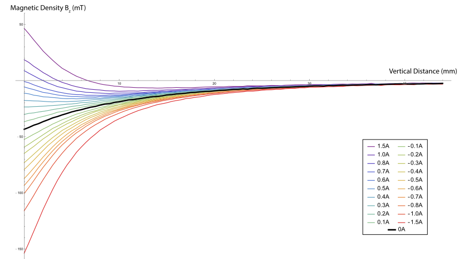

# An Open Magnetic Scanner : Results

To understand the differences between the two chosen actuators (see [Choosing the actuators](/general_actuators)), we scanned them in two different ways : 

- We mapped a large volume, either injecting a small current (0.2A) or no current. This allows to see the extent of the magnetic fields
- We mapped a small vertical column above the magnet, while varying the current (from -1A to 1A), to get the function $B(z,I)$.

#### Spatial variations

These graphs show the magnetic fields for the two electromagnets, with no current injected.

> Since the viewing algorithms are not yet optimized, loading these boxes can slow down your browser significantly. We kindly ask you to be patient.

 

We can also use projections to get better quantitative analysis : 

This figure shows the vertical component of the magnetic field generated by the two electromagnets, 1mm above their surfaces, in the axis of the cylinders.

Both fields have a similar spacial extension of 20mm, but the E-77-88 produces a field twice stronger than the WF-P25/20 for the same permanent magnet.

The same observation can be made at 8mm above the electromagnets : 

#### Current and vertical distance

The next graphs are scans that show the evolution of the vertical component of the field along the vertical axis of the electromagnet. We varied the injected current, using a benchtop power supply with a current limiter. We also plotted the same data, removing the field generated by the permanent magnet, to get the coil contribution.

We can quickly see that the permanent magnets create a much stronger vertical field when attached to the _E-77-88_ electromagnet compared to when attached to the _WF-P25/20_. However, the field caused by the injected current is of the same magntitude for the two magnets. Though the measurements of the current lack better precision (current was directly read on the power supply screen), we can already see that the contribution of the coil is approximately proportional to the injected current. Looking more closely at the field generated by _E-77-88_, we can see what we believe to be the effect of a $\mu_r$ decrease due to core saturation.

The scans lead us to use the _E-77-88_ electromagnet for most tests, as the stronger generated field would lead to better control.

> These measurements are used in [another section](/linearising), to linearise the effect of the actuators

#### Conclusion

These measurements show that the low-cost magnetic field scanner we have built can be used to study different magnetostatic objects such as actuators. The acquired measurements can then be compared to theoretical models that are otherwise hard to validate.