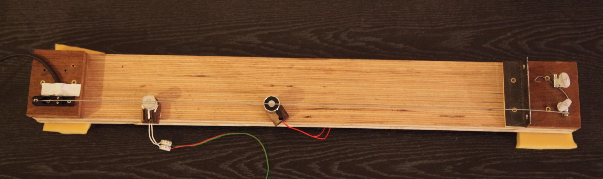
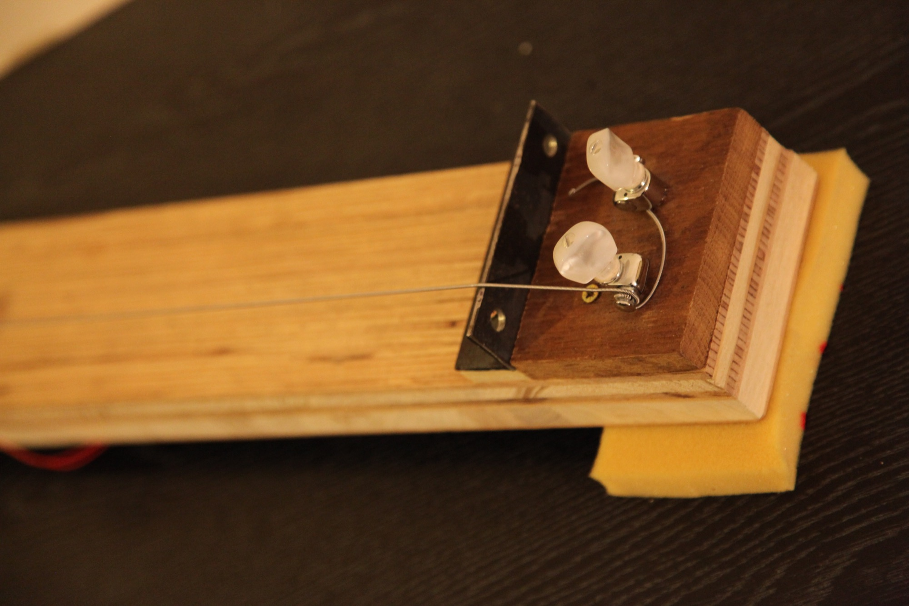
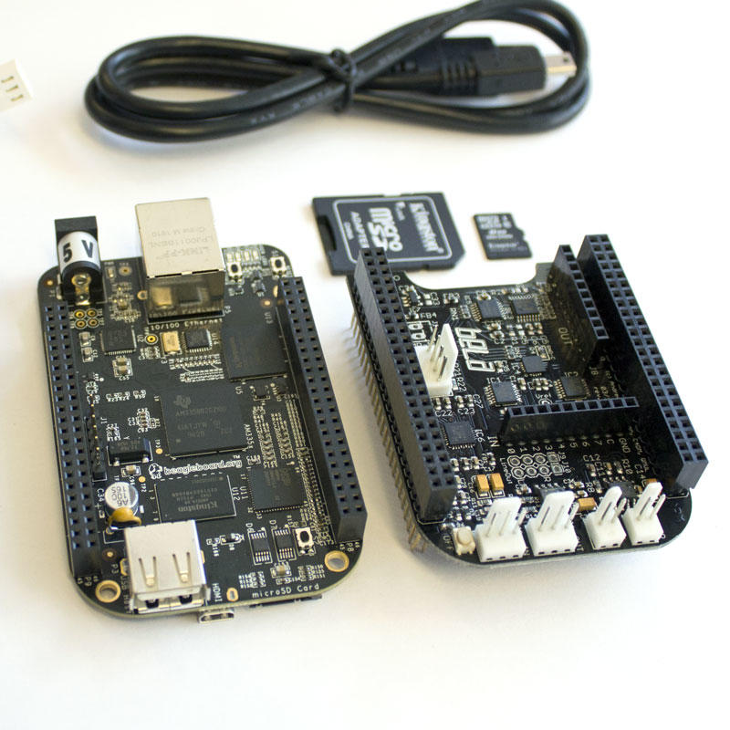
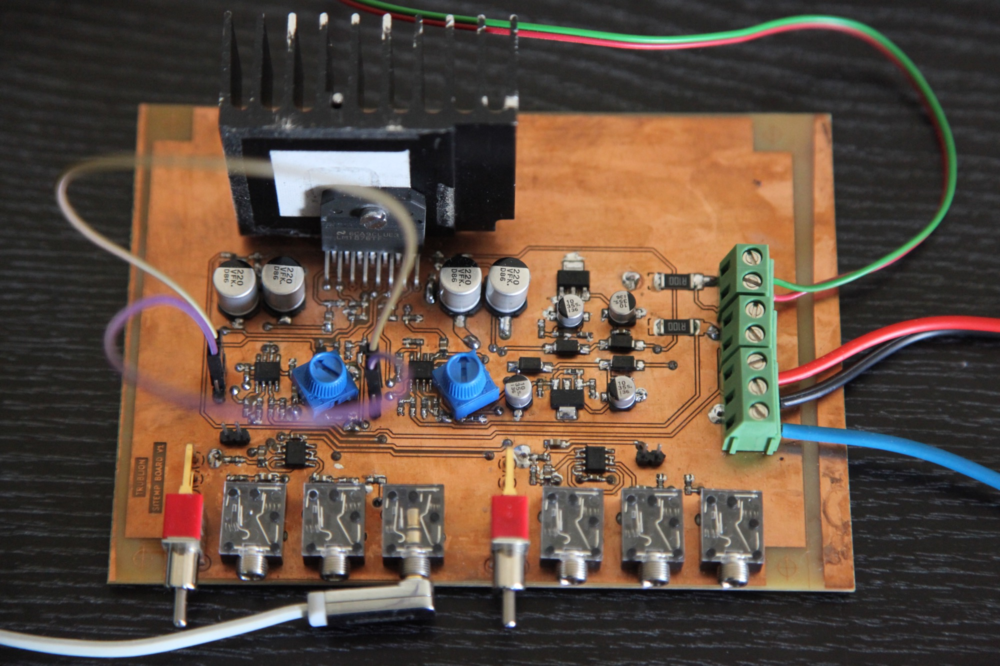

# Completing the setup

## Woodworking

To validate the choices made so far (sensors, actuators) and have a test setup from which to construct our model, we assembled a simple instrument we like to call the _Sitemp_ (for **Temp**orary **Sit**ar, since this is not the final version).

We followed advice given by Leo Maurel, a luthier with whom *Trublion* worked on the [hybrid violin project](http://trublion.org/projets/violon/). We used plywood beams for the body and we stacked two beams to increase thickness (~4cm) in order to compensate for the large clearance height needed for positioning the electromagnets underneath the strings. Two strings were attached using single bass bridges from ABM, a rigid nut made of steel and two tuning mechanisms designed for banjos (5th string variant, easier to install).

One of the string rests on the piezo bridge pickup, while the other was left non active, the auxiliary string was also used for sympathetic resonance (except when running control tests and measurements).

We used a bass guitar string (G, Nickel Wound XL from D'Addario) for the primary string, and a G guitar string for the second one.

## The Bela environment

> This section being fairly technical, we added a glossary at the end of this page.

Developed at the Centre For Digital Music (C4DM) by A.McPherson and his team, [_Bela_](bela.io) is \"_an embedded system for real-time audio processing with ultra-low latency_"@^BeagleRT It relies on the BeagleBone Black, an embedded computer running linux, which combines a powerful processor running at 1GHz with two realtime computation units (PRUs) running at 200MHz. _Bela_ uses these PRUs in combination with external audio codecs and ADCs to provide the main processor with the latest measurements from the sensors. This allows a very fast shuttling of data between the sensors and the processor.

_Bela_ consists of a BeagleBone Black, a _cape_ (a PCB board put on top of the BeagleBone) containing the codecs, and a linux image with custom software.

The software environment provided features a very convenient and well thought in-browser IDE. The scripts can be written in C/C++, but also in PureData (a visual programming language), Faust, Supercollider and other music oriented programming languages.

Though we experimented with PureData scripts, all algorithms presented in this report were written in C++, using the Bela API.

## The current drive amplifier

Current-output (or transconductance) amplifiers are a special type of amplifier design that allows the conversion of an input voltage into an output current. In practical terms, it means that the current running through the load is porportional to the input voltage (unlike in typical amplifiers, in which output voltage is controlled)@^Merilainen2010.

We replicated a circuit designed for the Magnetic Resonator Piano@^McPherson2012. This circuit, which was designed for the first versions of the MRP, uses a class AB amplifier with a shunt resistor and a second operational amplifier in the feedback loop.

Since our actuators produce a magnetic field which intensity is proportional to the applied current, this was a resonable choice for building the control system.
The current amplifier is limited by both the intrinsic stability properties of the amplifier IC but also by the range of the supply voltage.

We supplied the amplifier with $\pm20\text{V}$ rails generated by a dual rectifier circuit connected to a dual output toroïdal transformer (rated for 65VA).

The completed setup is summed up in the [next section](/summary_design).

### Glossary

- __`PRU`__ : A realtime processing unit, programmable using the Assembly language. It is independent from the main processor but shares the same memory. There are 2 in the _Sitara_ processor family from _TI_ used on the BeagleBone Black.
- __`ADC`__ : Analog to Digital Converter. It is a small electronic device that transforms an  analog signal (the voltage of a piezo pickup for example) into a digital signal.
- __`DAC`__ : Digital to Analog Converter. The opposite of a `ADC`, it transforms a digital signal (the result of calculations for example) into an analog signal that can be fed into the analog amplifiers.
- __`Codec`__ : A chip which handles both `DAC`/`ADC` processing and serial communication.
- __`API`__ : Application Programming Interface. Can be seen as a global library for controlling the system via simple functions.
- __`IC`__ : Integrated Circuit. A circuit built and enclosed in a small package.
- __`IDE`__ : Integrated Development Environment. An software environment designed to help developers organise and write code.