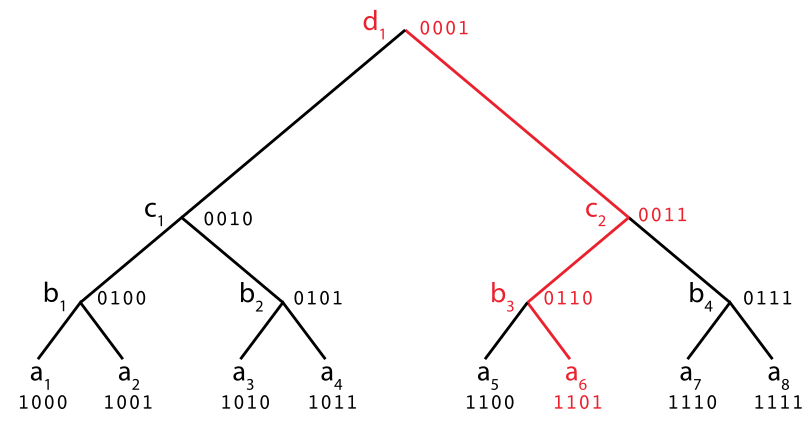
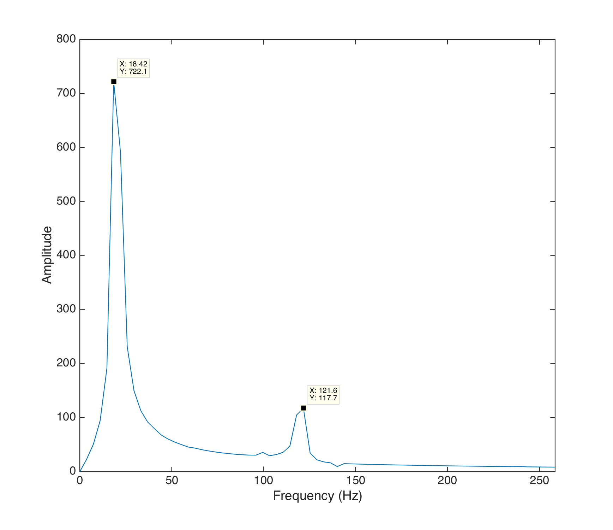
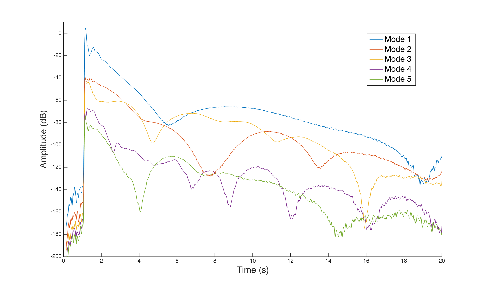

# The state-sensor algorithm

## Summary

To transform the signal coming from the piezo into a vector of mode amplitudes and phases, we needed an efficient and predictable algorithm similar to an FFT.
Using our knowledge of the frequencies of the signal, we built and optimized an algorithm akin to the Sliding DFT that is unnaffected by windowing effects, compensates for small changes in frequencies and provides a multi-mode phase lock mechanism.

## Basic concept

The idea of a modal control relies on the property of the instrument of only allowing certain frequencies, i.e. the fundamental and the harmonics. It also means that the sensor will see a pseudo periodic signal at with fixed frequency. We can thus use Fourier decomposition to analyse the signal and derive the amplitude and phase of its harmonics.

If $s$ were completely periodic, we could write it as a Fourier series : 

$$ s(t) = \sum_{n\in \mathbb{N}} C_n\sin(2\pi n f_0t + \phi_n)$$

We would then calculate $C_n$ and $\phi_n$ using Fourier analysis : 

$$C_n =\frac{2}{T_0}\left|\int_0^{T_0} s(t)\exp(-2i\pi n f_0t ) \text{ d}t\right|$$ and $$\phi_n =\arg\left(\frac{2}{T_0}\int_0^{T_0} s(t)\exp(-i2\pi n f_0t ) \text{ d}t\right) + \frac{\pi}{2}$$

Instead, $s$ can only be considered periodic during small time intervals, which means that in $(1)$, $C_n$ and $\phi_n$  are not constant but are changing slowly (with respect to the frequency of oscillation, that is $nf_0$).

Thus, we can see $s$ as :

$$ s(t) \approx \sum_{n\in \mathbb{N}} C_n(t)\sin(2\pi n f_0t + \phi_n(t))$$

In numerical analysis, a usual way to get $C_n$ and $\phi_n$ would be to use one of the FFT algorithms. They calculate the entire Discrete Fourier Transform for a given array of samples, in an optimal way : from a sequence of $x_n$ representing the signal, they calculate $$X_k = \sum_{n=0}^{M-1} x_m \exp(-2\pi i k m /M)$$ for $k \in [[0, N-1]]$. The FFT algorithms (any algorithm that can calculate these sums faster than the naive method) have a computational cost that depends on the sample size $M$, i.e. the number of values that represent the signal. The frequency precision is also dependent on the size of this array. An FFT is considered optimal when its cost is $O(M\log(M))$. For a $74\text{Hz}$ signal sampled at $44100\text{Hz}$, it would mean an array of 600 values, and a computational cost of roughly 2000 operations. A solution is simply to reduce the sample rate, but it also means reducing the frequency resolution. Another issue is windowing : the sample array does not contain an exact number of periods of a given frequency (except when $f_s/M$  is a multiple of the frequency of interest; $f_s$ being the sampling frequency). This causes inaccuracies or _leakage_, which are mitigated by _windowing_ techniques, but they all have tradeoffs.


In our case, we already know the exact frequencies we want to analyse, and we aim at having a very high refresh rate. Going back to the original formula for $s$, we can define $$C_n (t) = \frac{2}{T_0}\left|\int_{t-T_0}^{ t} s(\tau)\exp(-2i\pi n f_0 \tau ) \text{ d}\tau\right|$$ and $$\phi_n(t) =\arg\left(\frac{2}{T_0}\int_{t-T_0}^{t} s(\tau)\exp(-i2\pi n f_0  \tau) \text{ d}\tau\right) + \frac{\pi}{2} $$

And compute it numerically : 

$$C_{n,k} = \frac{2}{MT_0}\left|\sum_{m=1}^{M} s_{k-M+m}\exp\left(-\frac{2i\pi n f_0 (k-M+m)}{f_s}\right) \right|$$ and 

$$\phi_{n,k} = \arg\left(\frac{2}{MT_0} \sum_{m=1}^{M} s_{k-M+m}\exp\left(-\frac{2i\pi n f_0 (k-M+m)}{f_s}\right)\right) + \pi/2$$

where $s_{k} = s(k/ f_s)$ is the discrete equivalent of the continuous signal $s(t)$. 

Here, we only compute the DFT at specific frequencies, and we can tune the sample size $M$ to avoid windowing issues by setting it at $M = f_S/f_0$, i.e. we sample exactly one period of the fundamental frequency.

For convenience, let's define $e_n = \exp\left(\frac{-2i\pi n f_0}{f_s}\right)$.

The core of the algorithm is the sum $$\sigma_{n,k} = \sum_{m=1}^{M} s_{k-M+m} e_n^{k-M+m}$$ . 

We have $C_{n,k} = \frac{2}{MT_0}|\sigma_{n,k}|$ and $\phi_{n,k} =\arg(\frac{2}{MT_0}\sigma_{n,k})$. Computing $\sigma_{n,k+1}$, we find $$ \sigma_{n,k+1} = \sum_{m=1}^{M} s_{k+1-M+m} e_n^{k+1-M+m} = \sum_{m=2}^{M+1} s_{k-M+m} e_n^{k-M+m} = \sigma_{n,k}- s_{k-M+1}e_n^{k-M+1}  + s_{k+1}e_n^{k+1}\\ = \sigma_{n,k}- s_{k-M+1}e_n^{k+1} + s_{k+1}e_n^{k+1}$$ 

(since $e_n^M = 1$).

Thanks to this property, we can compute $\sigma_{n,k}$ using only two complex multiplications and additions per cycle.

The idea of the complete algorithm is to store the values of the sensor multiplied by their corresponding $e_n^m$ in a circular buffer, and then calculate the sum by removing the former last element and adding the new element.

In pseudo script : 

```C++
sigma_n = sigma_n - S[k]
S[k] = newSensorValue()*exp_n[k]
sigma_n = sigma_n + S[k]
k = (k+1)%M
```

Using this method, we can reduce the computational cost down to $O(N)$ (where $N$ is the number of harmonics of interest) at the maximum refresh rate, that is $f_s$, independently of the sample size. We also eliminate windowing issues by sampling exactly one period of the signal.

We later found that this algorithm uses the basis of the Sliding Discrete Fourier Transform@^Jacobsen2003 and almost identical to the modulated SFDT (mSDFT) algorithm@^Duda2010, with the difference that only specific frequencies are targeted, and that the sample size is tuned to avoid windowing effects. Unlike in the mSFDT, having only the phase shift and not the absolute phase is a desirable effect, so we do not compensate for it.

## Stability concerns

Typical DFTs have a well known stability issue : they are only marginally stable, with poles around the unit circle. This algorithm shares the same stability as the mDFT algorithm, with one pole at exactly $1$.

We were, however afraid of systemic errors in the calculations of the sums and products involved in the moving sum. The end of this paragraph shows this fear was not justified, but the solution offers an interesting way to accurately compute a sum with always recently calculated terms.

The method proposed here uses a different summing scheme that eliminates the summation error issue while keeping the computational cost at $N\log(M)$ where $M$ is the sample size and $N$ the number of modes of interest : 

We first build a binary tree of the previous sums of $s_{n,i} e_n^i$, with the $s_{n,i} e_n^i$  at the end of the tree. Each upper node represents the sum of the two nodes below it. When a new input is added, it replaces the oldest one in the buffer, and the corresponding branch (from the top node to this node) is recalculated. This approach thus requires $\log(M)$ complex additions, and one complex multiplication per cycle and mode of interest.


On this graph, which represents a situation with a sample size of 8, the $a_i$ represent the signal buffer values, the $b_i$ represent the sums of the pairs of $a_i$, and so on.

When a new element is added to the buffer (and replaces the old value), for instance $a_6$, we have to recalculate $b_3 = a_5 + a_6$, but also $c_2 = b_3 + b_4$, and finally $d_1 = c_1 + c_2$. 



This graph can easily be stored in an array, where the numbering is done by counting the elements from top to bottom, left to right. The algorithm then uses bitwise operation to move up in the tree : in pseudo code

```c++
S[sampleIndex] = newSensorValue()*exp_n[sampleIndex] // For example : sampleIndex = 1101
tempSumIndex = sampleIndex >> 1 // = 0110
S[tempSumIndex] = S[(tempSumIndex<<1)] + S[(tempSumIndex<<1)+1]
tempSumIndex = sampleIndex >> 1 // = 0011
S[tempSumIndex] = S[(tempSumIndex<<1)] + S[(tempSumIndex<<1)+1]
tempSumIndex = sampleIndex >> 1 // = 0001
S[tempSumIndex] = S[(tempSumIndex<<1)] + S[(tempSumIndex<<1)+1] // The total sum
sampleIndex = ((sampleIndex&0b0111) + 1)%M + 0b1000 // = 1110
```

This approach is not limited to sample sizes equal to powers of 2; the tree will just store zeros where the buffer stops. However, we must store a `2M` complex numbers array in the RAM, and the last calculation of `sampleIndex` uses a modulus division, which can be expensive.


The stability of the algorithm was not a real issue in the actual system, since the sum did not seem to get corrupted after a few minutes at a constant excitation. Reducing the precision from `double` to `float` was not detrimental to the stability of the output either, but the gain in performance (using CPU accelerations) was remarquable. Thus the current version of the system implements the simple sum algorithm using `float` samples array of roughly 600 elements.

## Testing accuracy and robustness in Matlab

The algorithm was tested for an application with low frequency (70Hz) signals, with a high sampling frequency (44.1 KHz), representing our test setup.

Typical precision for amplitude or phase was better than 3% with an SNR of 0dB, and 1% at -6dB.

We found that for when the amplitude increases over one period, the algorithm gives an approximate average of the amplitude over that period. The phase is more difficult to predict when the amplitude changes rapidly, but still within 10%.

Precision seems independent from the number of harmonics added.

When the frequency is different from the target frequency but within 1%, the amplitude is not affected, and the phase will vary so that $\sin(2\pi n f_0 t + \phi_n(t))$ remains at the frequency of the signal. 

A Matlab file with these tests is provided below.

## The issue of low frequency noise

The issue with real sensor signal is that the noise is not always gaussian, and mains can pollute the signal in an unpredictable way.

The low-frequency noise was a problem in our case since mains frequency (50Hz in Europe) is close to the system frequency (70Hz). It causes an oscillation of the amplitude and phase output values. 

Indeed if $s(t) = \alpha \sin(2\pi f_0t) + \beta\sin(2\pi f_{hum} t + \phi) = \alpha \sin(\omega_0t) + \beta\sin(w_{h}t + \phi)$, we get : (to slightly simplify the equations, let's assume $\phi=0$) 

$$C_0 (t) = \frac{2}{T_0}\left|\int_{t-T_0}^{ t} s(\tau)\exp(-\omega_0 \tau ) \text{ d}\tau\right| \\$$

$$= \frac{2}{T_0}\left|\int_{t-T_0}^{ t} \big(\alpha \sin(\omega_0 t) + \beta\sin(\omega_{h} t )\big) \exp(-\omega_0 \tau ) \text{ d}\tau\right|$$

$$= \left|-i\alpha  + \frac{2}{T_0}\int_{t-T_0}^{ t}  \beta\sin(\omega_{h} t) \exp(-\omega_0 \tau ) \text{ d}\tau\right|$$

$$=\left|\alpha + \frac{2\beta}{T_0}\sin(w_hT_0/2)\left(\frac{1}{\omega_h-\omega_0}\exp(i(\omega_h-\omega_0)(t-T_0/2))  \;+ \frac{1}{\omega_h+\omega_0}\exp(-i(\omega_h+\omega_0)(t-T_0/2)) \right) \right|$$

If $\alpha>>\beta$  (a factor 10 is more than enough), we can write 

$$ C_0(t) \approx |\alpha|\left| 1 + \frac{2\beta}{T_0\alpha}\sin(w_hT_0/2)\,\Re\left(\frac{\exp(i(\omega_h-\omega_0)(t-T_0/2)}{\omega_h-\omega_0} + \frac{\exp(-i(\omega_h+\omega_0)(t-T_0/2)}{\omega_h+\omega_0} \right) \right|$$

$$ C_0(t) \approx \alpha\left( 1 + \frac{2\beta}{T_0\alpha}\sin(w_hT_0/2)\left(\frac{\cos((\omega_h-\omega_0)(t-T_0/2)}{\omega_h-\omega_0} + \frac{\cos((\omega_h+\omega_0)(t-T_0/2)}{\omega_h+\omega_0} \right) \right)$$

Hence we can expect the mode 1 amplitude to be polluted by signals at frequencies $|f_{hum} + f_0|$ and  $|f_{hum} - f_0|$, the latter beging the strongest if the signal and hum frequencies are close.



The above graph is an FFT of the amplitude output of our algorithm running at 44.1kHz, for a 70Hz signal of amplitude 1, polluted by a 50Hz hum of amplitude 0.1. The peaks are located at 20Hz and 120Hz, with a ratio of amplitude consistent with the above formula: $117/722 \approx 1/6 \approx \frac{1/(70+50)}{1/(70-50)}$.

A solution to this issue would be to apply a low-pass filter to the input signal, but since the mains frequency was close to our frequency of interest, the filter would not only induce both an unwanted phase shift and a reduction of amplitude. 

Moreover, the noise was actually a combination of a 50Hz sine wave and of higher order harmonics, making the low pass filtering ineffective. A comb filter was also considered, but the harmonics frequencies of the signal and the mains noise were too close.

In the end, the practical solution was to thoroughly shield all high impedance cables and link all grounds with thick wires. This proved to be enough, as hum was inaudible in the sensor data.

One could also apply the exact same algorithm to determine the mains amplitude and phase, and use the output of both estimators to get a clean signal, but this is beyond the scope of this study.

## Using the algorithm to study the timbre of musical instruments

Having now an algorithm to study the change in amplitude of the different harmonics, we applied it to analyse the timbre of known instruments, such as the piano or the guitar.

Below are the sound sample and the graph of the timbre of an A4 (440Hz) piano note at 44100Hz, recorded on a Steinway grand piano using a Neumann KM 84 microphone (courtesy of [the University of Iowa Electronic Music Studio](https://www.freesound.org/people/feelander/sounds/316004/)).



The graphs are consistent with the acoustic perception of the harmonics modulation and the output of regular FFTs : below is the output of the FFT produced by [MusicScope](https://www.xivero.com/musicscope/), with the sound sample.

<video controls><source src="media/Piano.mf.A4_fft.mov" type="video/mov"><source src="media/Piano.mf.A4_fft.mp4" type="video/mp4"><source src="media/Piano.mf.A4_fft.webm" type="video/webm"></video>

## Attempts at re-synthesis

Using the data collected using the algorithm on the piano sample, we smoothed the curves using a gaussian filter. We also limited the number of modes to five.

The resulting smoothed amplitudes were used to modulate sine waves at the corresponding frequencies.

Below is the FFT produced by MusicScope for the resynthesed sound : 

<video controls><source src="media/re_synthesis.mov" type="video/mov"><source src="media/re_synthesis.mp4" type="video/mp4"><source src="media/re_synthesis.webm" type="video/webm"></video>

Though the gaussian filtering and the low number of modes make the sound less bright, the piano timbre is still very recognizable.

The fact that the timbre of the piano is recognizable even though the driving amplitudes are smoothed proved that if we could control the amplitude of each mode and make them follow a given trajectory, we would be able to approach existing timbres.

__This experiment lead us to use the $C_n(t)$ as the basic components of our state vector, and it guided us in the choice of our musical control : we decided to make the system follow arbitrary modal amplitude trajectories.__ 

The [next section](/dynamics) tries to apply this idea to a simple model to get the dynamics of the system.

## Similar algorithms

The family of Sliding DFTs regroups many algorithms that try to compute the Fourier coefficients of a signal, often with a certain knowledge of the target frequencies. A critical application was the *Dual-tone multi-frequency signaling* (DTMF) system that was a telephone communication standard until recently. Active research is conducted on this fields, as SDFT can be used as phase lock mechanisms (including in our case).

A common algorithm used is the _Goertzel algorithm_@^goertzel1958algorithm that was refined many times to compensate for its marginal stability and its limitation to signals of frequencies that have a common divisor@^Chicharo1996 . Goertzel uses a second-order IIR filter followed by a first-order FIR filter to get to the Fourier coefficients, using only real-valued multiplications.

Some variants of the SDFT try to solve its stability issue by adding a damping factor in the recursive loop@^douglas1997numerically ; but the marginal stability can also be bypassed by repositionning the poles of the filter on `1`, as the mSDFT@^Duda2010 and our algorithm do.

## The GitHub repo

All the tests described above are available on the [GitHub repository](https://github.com/jeremypatrickdahan/sitar-control) of the project, in the 

`/Fast_Fourier_Series_Coefficients` folder, in the _matlab_ language.

The C++ version of this algorithm is also available in the _Bela_ scripts, in `/control`.